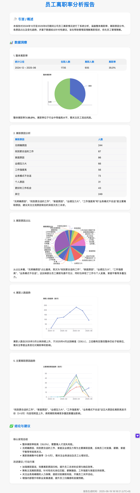
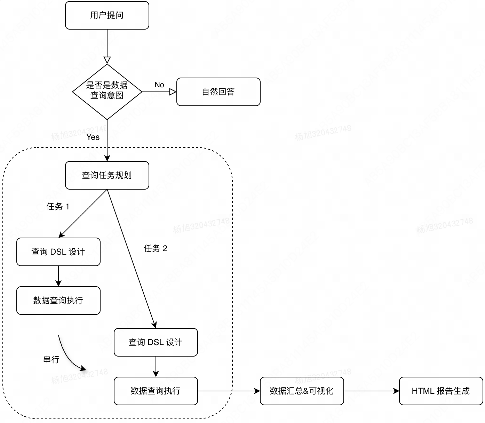
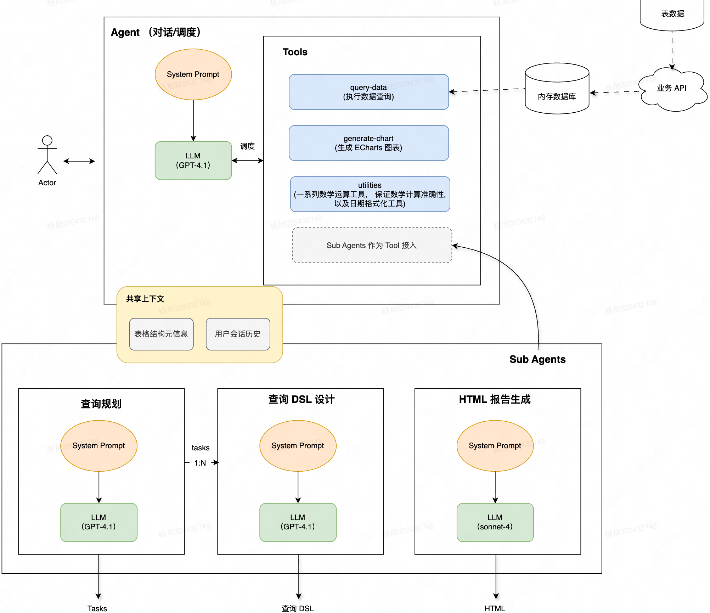
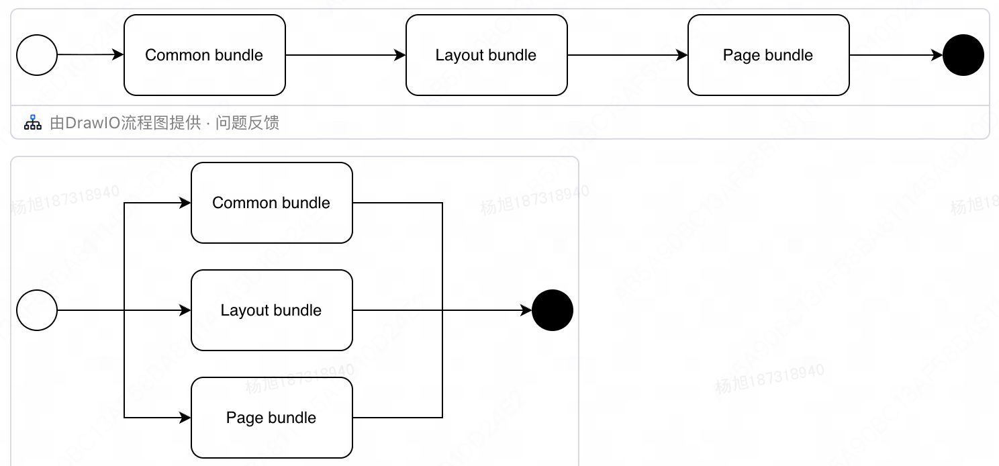
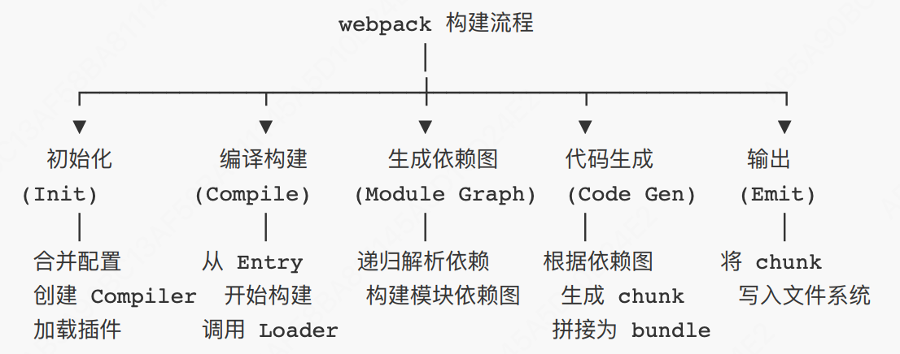
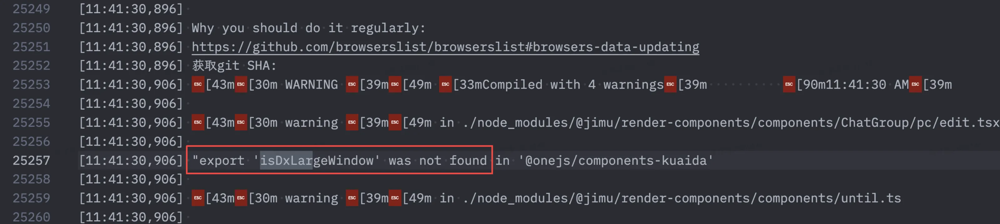
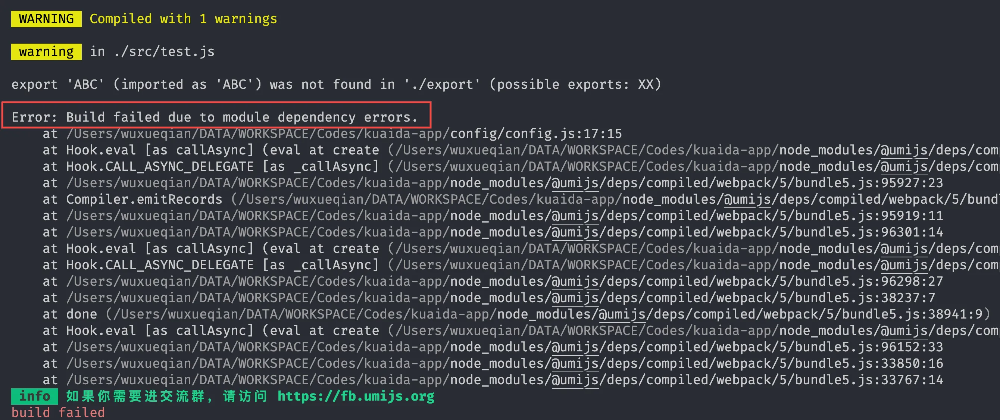
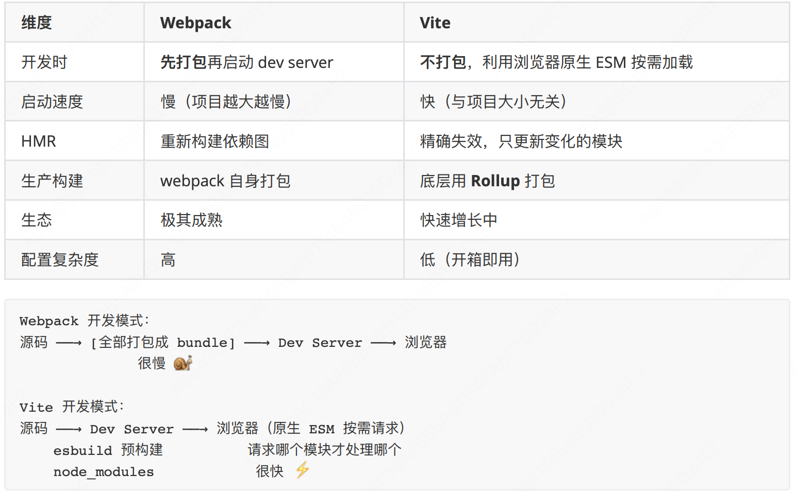
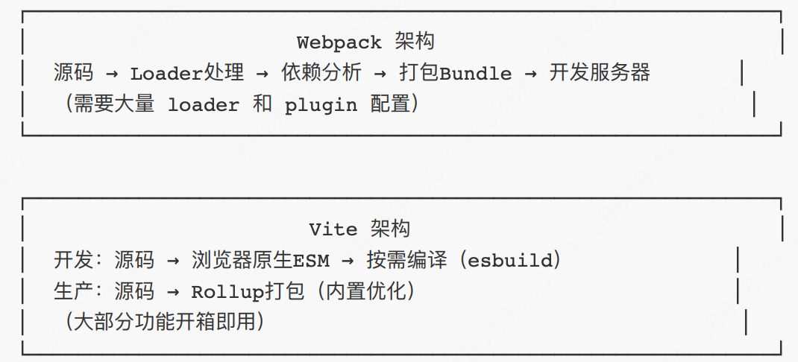
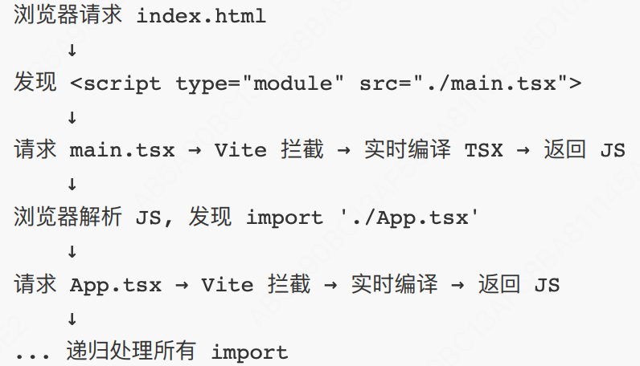

## Agent 记忆如何设计？上下文丢失如何处理？

## 多智能体 Multi-Agent 常见的协作模式有哪些？

三种主流模式：

1. 分⼯协作：规划Agent、检索Agent、执⾏Agent、评审Agent各司其职
2. 辩论博弈：多个Agent互相质疑、修正，提升正确性
3. 层级管控：主控Agent下发任务，⼦Agent执⾏并上报结果
   代表框架：AutoGen、MetaGPT、ChatDev

## 数据分析 Agent 架构？

示例图：

### 整体流程

数据分析 agent 规划的任务执行、错误重试完全由主 Agent 大模型调度，非编程方式


### Agent 架构

- 采用多 Agents 的方式，确保各 Agent 职责更明确，指令遵循更好
- 子 Agents 通过 tools 的方式接入到主 Agent，完全实现由 LLM 的调度
- 提供数据接入、绘图、数学计算、日期格式化等工具供 Agent 调用

架构图：

### 整体设计

- 前后端同构，MonoRepo，CSR
- Hono 作为服务端框架，提供 Chat API，页面视图 View
- Vercel AI SDK 作为支持 Chat 范式的基础框架（Streaming、Hook、UI State）
- Iframe 方式嵌入宿主项目页面（浮标点击触发 Iframe 容器展示）

### 设计细节

- 设计了固定的 JSON 风格的数据查询 DSL，该DSL解析为数据库/查询框架支持的查询语言（例如 SQL，或者后端的查询接口入参）
- 使用内存数据库和查询框架，一次性拉取全部数据，服务后续所有查询
- 可视化图表同时生成 SVG 和可交互的自定义块（Markdown 扩展语法）两部分，前者用于最终报告引用，后者用于对话中渲染
- 使用内存 S3 存储生成的图表、HTML 文件，并暴露访问地址

## 如何评估一个 Agent 系统的好坏？有哪些指标？

核⼼指标：

1. 任务成功率：是否按需求完整完成
2. ⼯具调⽤准确率：是否选对⼯具、传对参数
3. 幻觉率：编造信息、错误信息⽐例
4. 执⾏效率：平均步数、耗时
5. ⼈⼯替代率：减少多少⼈⼯操作
6. ⼯程指标：稳定性、并发能⼒、可观测性、异常率。

## 数据分析 DataAgent 输入输出指标？评测指标？

1. 输入指标
   - 会话完成率
     - 指标定义：成功完成流程的会话次数/会话总次数，基于以下指标复合 ai_event_chat_round、ai_event_chat_round_fail
       - 成功完成流程的判断条件：
         - 有回复消息
         - 回复消息如果不包含工作流则直接判断完成
         - 回复消息如果包含工作流则需要判断包含工作流最后阶段部分（final）
     - 现状：白盒用例数据 95%+
     - 目标：生产实际运行 95%+
     - 备注：用户提问的问题，需要完整给到准确输出。以下情况可能导致不准确输出
       - 工具调用错误（流程出错，导致没有预期进行 summary）
       - 工具执行错误 （ SQL 执行、Python 执行错误, 并且重试之后仍然有错误）
       - 流程未完成：出现空数据查询 （目前做严格校验，如下均属于流程未完成： ① 用户查错数据视图，比如查询了不存在的列. ② 用户用了一些专业术语：比如帮我查一下 "80后"、"90 后"用户占比，并且表中只有出生日期时间。③ 其他用户数据集问题）
     - 实现：工具严校验 + 人工确认；Raptor 上报
   - Raptor 错误率
   - 技能调用次数：生成报告的调用次数，ai_event_skill_request
   - 数据源查询耗时：
   - 阶段耗时：工作流步骤耗时
   - LLM API 耗时：ai_timing_llm_call
   - LLM API 成功率：ai_event_llm_call、ai_event_llm_call_error_429、xxx_4xx、xxx_5xx
   - MCP Bing Search 成功率：所有的减去失败的，ai_event_mcp_bing_search_call、xx_error
   - MCP Python 代码解释器成功率：
   - MCP Python 代码解释器耗时：ai_timing_mcp_code_interpreter_call
   - 会话整体耗时：ai_timing_chat_round
   - 用户踩赞数：ai_event_message_reaction、xxx_reaction_up、xxx_reaction_down
2. 输出指标
   - 周活跃用户（产品使用行为）
   - 周单用户会话次数（用户粘性）：近一周 4.3；63 trace / 15 user

## 如何从 0 实现一个轻量的 ReAct Agent？

极简架构五步：

1. 定义系统提示，固定 Thought → Action → Observation 格式
2. 解析 LLM 输出，抽取出⼯具名和参数
3. 执⾏器调度⼯具，获取结果
4. 把观察结果拼回上下⽂，继续循环
5. 设置终⽌条件：任务完成 or 达到最⼤步数
6. 全程加状态管理、异常捕获、结果校验

## Agent 的未来演进方向你怎么看？

⾼分回答：

1. 更稳定的规划能⼒：减少随机性，增强可控性
2. 轻量化端侧 Agent：⼩模型也能做决策与执⾏
3. ⻓期记忆与持续学习：从经验中迭代策略
4. 多智能体协同：复杂任务流⽔线化
5. 安全对⻬强化：权限、边界、校验更严格

## 回复超时（断网、token超限）、重试、成本、人要确认（HITL）、运行时、可观测性（出了事故怎么查和改）、评测 Eval

[稀土掘金](https://juejin.cn/post/7633624091766161418#heading-0)

真要拆职责，可以收成六层：

- 交互层：用户看得见、点得着的界面，负责步骤展示、审批、中断、重试和结果反馈
- 编排层：用 LangChain、LangGraph 等把 Prompt、模型、工具、记忆和状态流转组织成可维护的流程
- 运行时 Harness：管理步数、超时、预算、快照、重试、取消和收尾，决定任务如何真正跑完或安全停下
- 安全与检测层：在输入、工具执行前、输出和轨迹上做规则与模型检测，拦住不该发生的行为
- 可观测层：用 `Trace`、`Metrics`、日志把每一步变成可查询、可对比、可回放的事实
- 评测层：通过离线集、回归闸门和线上灰度，用数据判断一次改动到底有没有变好

## SSE 断流

[稀土掘金](https://juejin.cn/post/7643469288817508390#heading-5)

- 如果用户切换页面，或者网络断开，再切回来能实现自动续上吗？
- 用户网络波动（比如断网，网速时慢时快），WiFi 自动降级导致AI项目的流式输出中断
- 浏览器标签页被误关，重新打开后对话记录还在，但刚才那轮生成的内容丢失了
- 长任务生成到一半，服务端负载过高触发自动扩容，连接被重置
- 用户主动刷新页面，想保存刚才的内容，数据却丢失了

1. 面试官："如果让你用一句话概括你的“AI中断恢复”的实现思路，你会怎么做？"
   答："我会让生成过程像视频播放一样**支持断点续传**——核心是在生成过程中持续'落盘'状态，而不是等到结束才保存。"
   面试官："具体怎么落盘？"
   答："我设计了一个三层状态恢复模型

2. AI生成到一半，突然断了，服务端的状态该怎么处理？
   面试官："连接断开的那一时刻，LLM 可能还在推理，这个时候是直接停止生成，还是有其他更好的方案呢？"
   答："不用停止生成，这正是最容易踩坑的地方。我设计了一个六状态生成状态机，(Redis缓存)

3. 面试官："用户刷新页面，浏览器内存全清空了，你凭什么让用户立即看到之前的内容？"
   答："靠客户端双保险缓存， 具体的实现代码如下，恢复时的优先级顺序是：内存 > IndexedDB > 服务端冷存储。

4. 面试官："我问几个边界情况。第一，AI生成恢复时，已生成的内容过长，重新组装 Prompt 再发给模型，上下文窗口溢出了怎么办？"
   答："可以对已生成内容，做智能摘要压缩，只保留关键结论作为上下文，而不是全文重传。我们可以在 Prompt 里区分 `history_summary` 和 `continuing_context`，让模型知道'这是前文摘要，请基于它继续完成'。"
   这是一个非常实用且高频的解决方案，建议大家在AI项目中都采用。
5. 面试官："第二个问题，LLM 有随机性，恢复后续写时，风格变了、人称变了，前后不一致怎么办？"
   答："在恢复 Prompt 里注入风格锚点（style anchor），明确告知模型'请保持前文的第一人称叙述风格'。同时，`checkpoint` 里记录了生成时的 `temperature` 和 `top_p`，恢复时严格复用，最大程度保证一致性。"
6. 面试官："第三个问题，如果模型版本升级了，旧版 KV Cache 新版加载不了，如何解决呢？"
   答："可以通过序列化时加入模型版本标识和序列化协议版本。恢复时严格校验兼容性，不兼容时自动降级为'文本级恢复'——从文本断点重新生成，而不是推理状态断点。虽然会多花一点算力，但至少不会崩溃。"

## 观测 Langfuse

[langfuse doc](https://langfuse.com/docs/observability/get-started)

- secret-key：sk-lf-3f651909-870f-45d1-83bd-eedabd230365
- public-key：pk-lf-42c12906-b498-4853-abd5-320260532821
- .env
  > LANGFUSE_SECRET_KEY = "sk-lf-3f651909-870f-45d1-83bd-eedabd230365"
  > LANGFUSE_PUBLIC_KEY = "pk-lf-42c12906-b498-4853-abd5-320260532821"
  > LANGFUSE_BASE_URL = "https://langfuse.sankuai.com"

## 评测 Eval

## React

### useState、useEffect、useCallback、useMemo、useRef 实现原理

每个 hook 对应一个链表节点，按调用顺序存储，所以不能条件调用，否则状态对应错误，更新错乱

| Hook          | Hook                        | 更新策略     | 典型场景       |
| ------------- | --------------------------- | ------------ | -------------- |
| useRef        | { current } 对象            | 永不更新引⽤ | DOM引⽤/定时器 |
| useMemo       | 计算结果                    | deps变化时   | 昂贵计算缓存   |
| useCallback   | 函数引⽤                    | deps变化时   | 传递给⼦组件   |
| useMemoizedFn | 函数引用，useCallback升级版 | -            | -              |

#### setState 是同步还是异步？

- React 18 之前（16/17）只在合成事件和生命周期中批量更新，异步的；原生事件或setTimeout、Promise 中是同步的。（同步代码中异步批量更新，异步代码中，同步更新）
- React18后，所有情况下都是自动批量更新，可以使用 `flushSync` 或 `setState` 回调函数实现立即更新
- React 16/17 的批处理依赖内部标志 `isBatchingUpdates`
  - 在合成事件/⽣命周期执⾏前，React 会把这个标志设为 `true`
  - setTimeout 代码执⾏时，React 没有机会设置这个标志，所以每次 setState 都直接触发渲染
  - setState 异步的原因是将更新放入队列，批处理后统一渲染，减少 re-render，提高性能
- React18后，优化了**自动批处理和并发更新**，引入了新的调度器，使用微任务收集更新，setState不再依赖`isBatchingUpdates`标志，而是：每次state更新 -> 把更新推入队列 -> 调度一个微任务来 `flush`

#### useRef 的用法

`useRef` 创建一个可变的 ref 对象，可⽤来存储任何类型的数据，在组件整个生命周期都有效，数据修改不会出发组件的 re-render。可用来：保存上⼀次的 props 或 state：有时你可能需要在组件内部访问上⼀次的 props 或 state，可以使⽤ `useRef` 保存这些值

### 对 React Hook 的理解？解决了什么问题？

- Hook 是 React 16.8 的新增特性。它可以让你在不编写 class 的情况下使⽤ state 以及其他的 React 特性。
- 在以前，函数组件也被称为⽆状态的组件，只负责渲染的⼀些⼯作。因此，现在的函数组件也可以是有状态的组件，内部也可以维护⾃身的状态以及做⼀些逻辑⽅⾯的处理。
- Hooks让我们的函数组件拥有了类组件的特性，例如组件内的状态、⽣命周期。

### Hooks 为什么有闭包陷阱？

useEffect 的调用里面使用的变量都是当时函数创建时候的，后续更新会再次调用

### React 类组件和函数组件有什么区别？如何理解？

### React Router 原理

hash 路由 VS history 路由，参考 [pages/ReactStudy/Router.tsx]('../src/pages/ReactStudy/Router.tsx')

### Context 和 zustand、mobx 状态管理库有何区别？

- `Context` 会产生多层嵌套，状态更新，所有的消费组件都会更新，无法像状态库那样实现定向细粒度的更新
- 比如 `AppContext` 包含 user、theme，即使只有 theme 改变，使用到 user 的组件也会重新渲染，适合简单低频数据更新场景，比如 主题、多语言、用户信息
- 高频更新，需要派生状态，性能敏感场景，建议用状态库 `zustand`，体积仅 `1kb`

### ErrorBoundary 错误捕获 和 全局错误上报

1. 只能捕获 React 组件生命周期内的渲染出现的问题，无法捕获异步错误、事件回调
2. 全局错误上报： `window.onerror` 和 `window.addEventListener('error')`
   - onerror 是赋值操作，在全局只能存在一个，后面的覆盖前面的
   - addEventListener 是标准监听模式，可以绑定多个回调函数，不干扰第三方 SDK
   - 共同点：两者都只能捕获同步代码和 setTimeout / setInterval 等宏任务中的运行时错误，对于未处理的 Promise 拒绝报错，必须用 `window.addEventListener('unhandledrejection')`

   ```ts
   window.onerror = function (message, source, lineno, colno, error) {
     // 包含详细的行列信息和错误对象
     console.log('捕获到错误:', message);
     return true; // 返回 true，控制台就不会再显示红色的报错信息
   };

   window.addEventListener(
     'error',
     (event) => {
       console.log('捕获到错误:', event.error);
       event.preventDefault(); // 阻止浏览器控制台报错
     },
     true
   );
   ```

### React 组件间过渡动画如何实现？

在React中实现组件间过渡动画可以使⽤ `React Transition Group` 库。该库提供了⼀组组件，可以在组件进⼊或离开 DOM 时添加或删除 CSS 类名，从⽽实现过渡动画效果。CSSTransition（单组件动画）；多组件切换动画：SwitchTransition；列表动画：TransitionGroup。

### 为什么 file 输入框不能受控？

因为⽂件是⽤户本地隐私数据，React 不能通过 state 赋值 value 控制，只能由⽤户⼿动选择，所以天⽣⾮受控

### React 奇技淫巧

```ts
// 1.使用 ref 回调函数初始化 ref，避免使用 useEffect
const FocusInput = () => {
  const ref = useCallback((node) => node?.focus(), []);
  return <input ref={ref} type="text" />;
};
// 2.可取消的接口请求
const createCancelTask = (asyncTask) => {
   let cancel = () => {};
   return (...args) => {
      return new Promise((resolve, reject) => {
         cancel();
         cancel = () => {
            resolve = reject = () => {};
         };

         asyncTask(...args)
            .then(resolve)
            .catch(reject);
      });
   };
};

// const createTask = (name, delay) => () => {
//   console.log(`${name} 开始执行`);
//   return new Promise((resolve) => {
//     setTimeout(() => {
//       console.log(`${name} 执行完成`);
//       resolve(`${name} 的结果`);
//     }, delay);
//   });
// };
// const cancelableTask = this.createCancelTask(createTask);
// cancelableTask('任务1', 2000).then((res) => console.log('收到结果:', res));

// setTimeout(() => {
//   const cancelableTask2 = this.createCancelTask(createTask);
//   cancelableTask2('任务2', 1000).then((res) =>
//     console.log('收到结果:', res)
//   );
// }, 800);

// 3.检测是否有modal弹窗，detectMaskShow，负责嵌套iframe的通信
/**
 * iframe模式下向父级发送消息
 * @param type
 * @param message
 */
export const postMessage = (type, message, isToTop?: boolean) => {
  if (window.parent === window) {
    return;
  }
  if (isToTop) {
    window.top.postMessage(
      JSON.stringify({
        channel: 'FRAME_APP',
        type,
        data: message
      }),
      deployEnv === 'development' ? '*' : undefined
    );
    return;
  }
  window.parent.postMessage(
    JSON.stringify({
      channel: 'FRAME_APP',
      type,
      data: message
    }),
    deployEnv === 'development' ? '*' : undefined
  );
};

/**
 * 检测是否有modal弹窗，通知iframe的父级隐藏弹窗的关闭按钮
 * @returns
 */
export const detectMaskShow = () => {
  const targetNode = document.body;
  const config = { childList: true, subtree: true };

  const callback = function (mutationsList) {
    for (const mutation of mutationsList) {
      if (mutation.type === 'childList') {
        if (mutation.addedNodes) {
          const hasModal = Array.from(mutation.addedNodes).some((item: any) =>
            item.classList?.contains('mtd-modal-wrapper')
          );
          if (hasModal) {
            // 当iframe内部还存在modal框，modal的mask的背景色需要变浅
            const modal = Array.from(mutation.addedNodes).find((item: any) =>
              item.classList?.contains('mtd-modal-wrapper')
            );
            // console.log('--modal', modal, modal.childNodes)
            let mask;
            for (const node of modal.childNodes) {
              if (node.classList?.contains('mtd-modal-mask')) {
                mask = node;
              }
              break;
            }
            mask.style.background = 'rgba(0, 0, 0, 0.2)';
            postMessage('HIDE_MODAL_CLOSE', '');
            break;
          }
        }
        if (mutation.removedNodes) {
          const hasModal = Array.from(mutation.removedNodes).some((item: any) =>
            item.classList?.contains('mtd-modal-wrapper')
          );
          if (hasModal) {
            postMessage('SHOW_MODAL_CLOSE', '');
            break;
          }
        }
      }
    }
  };
  const observer = new MutationObserver(callback);
  observer.observe(targetNode, config);
  return () => {
    observer.disconnect();
  };
};
```

## 性能优化

**性能指标：**

- 首次内容绘制（FCP，First Contentful Paint）：表示浏览器首次绘制来自DOM的内容。例如，对用户可见的文本或图像。它标记了浏览器开始在屏幕上渲染页面内容的时间点。
- 首次绘制（FP，First Paint）：表示浏览器首次进行任何渲染，包括布局或者背景颜色等。它标记了浏览器开始在屏幕上渲染任何内容的时间点。
- 最大内容绘制（LCP，Largest Contentful Paint）：表示在视口中最大的页面元素加载的时间。这个指标用于量化用户在主要内容元素被渲染出来时的感知加载速度。
- 首屏时间 （FST，First-Screen-Time）：是指从用户打开网页开始，到网页首屏内容渲染完成的时间。它主要关注的是用户最初看到的页面内容的加载速度。
- 首字节时间（TTFB，Time To First Byte）：是指从浏览器发送请求到从服务器接收到第一个字节的响应数据所花费的时间。这个时间包括了网络延迟时间、服务器处理时间等因素。在网页性能优化中，首字节时间是一个重要的指标，它直接影响到用户的等待时间和网页的加载速度。如果首字节时间过长，可能会导致用户感觉网页加载速度慢，影响用户体验。
- 可交互时间（TTI）：

**性能优化步骤：**

1. 执行 yarn analyze:pc 查看原始打包结果：parsed：9.31m；gzip：2.46m
   结论：多个路由懒加载文件里打包了相同的内容，比如@ss/mtd-react、@block/pug、@jimu等公共依赖，可以进行拆包处理
2. lighthouse测试网页性能
3. 是否有懒加载，拆包策略是否合理
4. 考虑是否有最新引入的包的影响，以及引入是否规范，talos上可看到每个版本的包大小，进行不同版本的包大小对比
5. 通过 raptor 慢访问分析、接口的请求分析，提取耗时的 Api 请求，考虑是否可以通过并行加载或者延迟加载【数据量比之前更大，请求耗时严重】
6. 观察 raptor 上的性能分析曲线：包括首字节时间、DomReady时间、首屏时间等性能指标，结合不同设备、不同系统、不同容器及页面访问量进行定性分析
7. 不同项目的TP50和TP90对比分析
8. 静态资源缓存失效问题？
9. 路由懒加载所导致的资源串行下载，如果能实现并行加载会提高效率 

### 基础配置

尽量使用 ESM 替代 CommonJS 模块化，保证有效的 tree-shaking

- 路由懒加载、Suspense包裹
- useMemo、useCallback、memo
- 图片懒加载、换成webp轻量格式
- 按需导入（echarts、lodash/lodash-es） babel-plugin-import
- dayjs 替换 moment
- 业务api并行请求、prefetch、preload预加载资源（js、css、img等）

### webpack 拆包原则

[拆包说明](https://github.com/cisen/blog/issues/143)
[webpack配置说明](https://blog.csdn.net/weixin_38255079/article/details/122967968?spm=1001.2101.3001.6650.1&utm_medium=distribute.pc_relevant.none-task-blog-2%7Edefault%7EBlogCommendFromBaidu%7ERate-1-122967968-blog-118856235.235%5Ev38%5Epc_relevant_sort_base1&depth_1-utm_source=distribute.pc_relevant.none-task-blog-2%7Edefault%7EBlogCommendFromBaidu%7ERate-1-122967968-blog-118856235.235%5Ev38%5Epc_relevant_sort_base1&utm_relevant_index=2)
Code Splitting 优化指南 3. 网络优化指南
`/* 	
	主要是将node_modules中的第三方库和被多次引用的模块进行拆分，以实现代码的复用和缓存 
  1、chunks字段的值为all，表示同时对同步和异步代码进行拆分。如果你的项目中没有使用到异步加载的代码，可以将chunks的值改为initial，只对同步代码进行拆分
  2、minSize字段的值为30000，表示只有当模块的大小超过30kb时才会进行拆分。这个值可以根据实际项目的需要进行调整，如果项目中有很多小于30kb但是被频繁引用的模块，可以适当降低这个值
  3、maxInitialRequests字段的值为5，表示入口文件最多只能被拆分成5个文件。这个值也可以根据实际项目的需要进行调整，如果项目的入口文件非常大，可以适当增加这个值
  4、在cacheGroups中，你为每个需要拆分的模块都设置了一个缓存组，这样做的好处是可以对每个模块的拆分策略进行单独配置。
  	但如果有很多模块的拆分策略是相同的，可以考虑将这些模块放在同一个缓存组中，以减少配置的复杂性
  5、在cacheGroups中，你为vendors和default两个缓存组设置了priority字段，这个字段表示当模块符合多个缓存组的条件时，会被分配到priority值最大的缓存组中。
  	你可以根据实际项目的需要，为其他的缓存组也设置priority字段，以控制模块的分配策略
  6、reuseExistingChunk字段的值为true，表示如果当前的模块已经被拆分过，那么在进行新的拆分时，会复用已经存在的拆分结果，而不是重新进行拆分。这个字段的设置是合理的，可以避免不必要的拆分操作
*/`

分包策略一般从路由或模块维度进下，主要从**缓存利用率**和**加载性能**两个维度考虑，采⽤了 5 层分包架构：

1. 基础框架层੶constvendors：React、ReactDOM、Lodash、core-js 等核⼼库，优先级最⾼，⼏乎不会变化，可以⻓期缓存
2. UI组件层：将 Antd、ppfish、rc-components 等 UI 库独⽴打包，因为这些库体积⼤但更新频率低
3. 图表可视化层 echarts：按需引⼊（减少体积），独⽴打包（优化缓存和加载）
4. 第三方库兜底 vendors：其他未显式配置的 node_modules，使⽤ reuseExistingChunk 避免重复打包
5. 业务公共代码 common：被 2 个以上 chunk 引⽤的业务代码⾃动提取

结果：⽤户升级业务代码时，constvendors、antd 等包不会重新下载，缓存命中率提升约 60%

```ts
export const splitChunks = {
  chunks: 'all',
  minSize: 20000,
  maxSize: 10 * 1024 * 1024, // 单个 chunk 最⼤ 10M，防⽌ terser 内存溢出
  cacheGroups: {
    // 常⽤基础库 - 更新频率：低 → ⾼优先级（更好的缓存）
    constvendors: {
      name: 'constvendors',
      test: /[\\/]node_modules([\\/]react|[\\/]react-dom|[\\/]react-router|[\\/]lodash|[\\/]core-js|[\\/]axios)[\\/]/,
      priority: 10 // 最⾼优先级
    },
    // UI组件库 - 体积⼤，独⽴分包
    ppfish: { name: 'ppfish', test: /ppfish/, priority: 0 },
    antd: { name: 'antd', test: /antd/, priority: 0 },
    antdGroup: { name: 'antd-group', test: /@ant-design/, priority: 0 },
    rcComponents: { name: 'rc-components', test: /rc-|@rc-component/, priority: 0 },
    // 业务SDK - 按功能拆分
    nimlib: { name: 'nimlib', test: /NIM_Web_NIM/, priority: 0 }, // IM SDK
    aws: { name: 'aws', test: /aws-sdk/, priority: 0 }, // 云存储
    ysfLexical: { name: 'ysf-lexical-editor', test: /@ysf[\\/]lexical-editor/, priority: 0 },
    ysfVideoChat: { name: 'ysf-video-chat', test: /@ysf[\\/]video-chat/, priority: 0 },
    // 其他第三⽅库
    vendors: { name: 'vendors', test: /node_modules/, priority: -10, reuseExistingChunk: true },
    // 业务公共模块
    common: { name: 'common', priority: -20, minChunks: 2 }
  }
};
```

- 9 个 JS ⽂件并⾏下载（浏览器 6 个连接） 升级HTTP2支持更多并行加载
- defer （html-webpack-plugin 5.0默认scriptLoading为defer，异步下载，按顺序执⾏）不阻塞HTML解析，⾸屏更快
- ⽂件名带哈希，⻓期缓存
- CDN 加速
- 更新 React → 只重新下载 vendors-react.js（~58 KB）
- 更新业务代码 → 只重新下载 app_entry.js（~156 KB）

### 按需加载

1. 组件库方可以提供按需加载吗？
   答：可以，历史上组件库都是CommonJS规范，无法treeshaking。现代库通过 ESM + sideEffects:false 让使用方零配置，antd v5 就是典型

2. 没有 sideEffects 配置会怎样？
   默认情况下，webpack 认为所有模块都有副作用（保守策略）。看个例子：

   ```ts
   // math.js
   export const add = (a, b) => a + b;
   export const sub = (a, b) => a - b;
   // app.js
   import { add } from './math.js';
   console.log(add(1, 2));
   ```

   - 没有 `sideEffects: false` 时：
     webpack 会想："虽然 `sub` 没被用，但 math.js 这个文件万一有副作用呢？比如它可能在文件顶部执行了 window.xxx = 'something'。我不能删它，得保留整个文件。"
     结果：sub 函数虽然没被调用，但它的代码定义还在 bundle 里，Terser 不敢删（因为它不知道 sub 是不是被别的途径引用了，或者有没有副作用）。
   - 有 `sideEffects: false` 时：
     webpack 收到库方的明确承诺："我这库所有模块都是纯的，没有副作用，没用的东西随便删。"
     于是 webpack 敢把 sub 标记为未使用，Terser 在压缩阶段直接删掉 sub 的定义。最终 bundle 里只有 add。

方案 A：库方提供 ESM 产物 + `sideEffects: false`（推荐），在 package.json 声明，这样 webpack/Vite/Rollup 天然能 tree shaking，完全不需要 babel-plugin-import。antd v5 就是这么做的，官方明确说"不再需要 babel-plugin-import"，antd v4 用的是 ESM + sideEffects，但样式还是需要插件或手动引入

```json
{
  "module": "es/index.js", // ESM 入口
  "sideEffects": false // 告诉 webpack 所有文件都可 tree shaking
}
```

方案 B：库方自己发布配套 babel 插件，库方可以发一个 @onejs/babel-plugin-components-kuaida，把规则内置好，使用方只需，@block/plug/importPluginOptions.js 就是这种思路的半成品——库方把配置抽成一个文件导出，使用方 require 进来传给 babel-plugin-import，避免每个项目都重写一遍规则。

```ts
extraBabelPlugins: [require('@onejs/babel-plugin-components-kuaida')];
```

```ts
const extraBabelPlugins = [
  [
    'import',
    {
      libraryName: '@onejs/components-kuaida',
      customName: (compName) => {
        if (compName === 'locale') {
          return '@onejs/components-kuaida/lib/locale/out.js';
        }

        if (utilsFuncName.includes(compName)) {
          return '@onejs/components-kuaida/lib/utils/index.js';
        }
        if (compName === 'get-all-field-ids') {
          return '@onejs/components-kuaida/lib/kd-formula-editor/index.js';
        }
        return `@onejs/components-kuaida/lib/${compName}`;
      },
      libraryDirectory: 'lib',
      transformToDefaultImport: false
    },
    '@onejs/components-kuaida'
  ],
  ['import', { libraryName: '@ss/mtd-react', style: 'css' }, 'mtd'],
  ['import', { libraryName: '@ss/mtd-react3', style: 'css' }, 'mtd3'],
  ['import', importPluginOptions, '@block/plug'],
  [
    'import',
    {
      libraryName: '@ss/mtd-react-mobile',
      libraryDirectory: 'lib/components',
      style: 'css'
      // "style": true 会加载 less 文件
      // "style": false 不会加载样式文件
    },
    '@ss/mtd-react-mobile'
  ]
];
```

## webpack

### webpack 核心原理

Webpack 的核⼼是从 Entry 出发，通过 Loader 转译模块、构建依赖图，将模块组装为 Chunk 并输出为 bundle。通过 Tapable 钩子系统实现⾼度可扩展的 Plugin 机制。⾯试中重点掌握：构建流程、Loader/Plugins 区别与编写、HMR 原理、Tree Shaking、性能优化、Webpack 5 新特性


**babel转译原理**
Babel 本质上就是⼀个 源码到源码（source-to-source） 的编译器：

1.  Parse — ⽤ @babel/parser 把代码变成 AST（抽象语法树）
2.  Transform — ⽤访问者模式遍历 AST，Plugin 对节点做增删改
3.  Generate — ⽤ @babel/generator 把新 AST 变回代码

这套架构让 Babel 拥有极强的扩展性——任何⼈都可以写 Plugin 来定义⾃⼰的代码转换规则。
AST 就是代码的结构化表示——把「⼀⾏⾏的⽂本」变成「⼀棵有层级关系的树」，让程序可以像操作数据结构⼀样去分析、修改和⽣成代码。
⼏乎所有⽇常⽤到的开发⼯具（编译器、Lint、格式化、打包、IDE）底层都在操作 AST

### tree-shaking

前提条件：

1. 必须使⽤ ES Module（ import/export ），不能是 require
2. 因为 ESM 是静态结构，编译时就能确定导⼊导出关系

3. 构建阶段：分析 AST，标记每个 export 是否被 import 使⽤
4. ⽣成阶段：未被使⽤的 export 标记为 `/_ unused harmony export _/`
5. 压缩阶段：Terser 删除这些 dead code

### loader 和 plugin

### plugin 生产实际的一个例子

举例：

- 构建耗时 Plugin：统计编译耗时并输出报告
  原理：在 compile 和 done 两个钩⼦间算时间差
- 打包体积监控 Plugin：超出体积阈值时发出警告，防⽌产物膨胀。
  原理：在 emit 钩⼦遍历 compilation.assets，对⽐ size() 和阈值
- 构建完成通知 Plugin：
  场景：⻓时间构建结束后，发送系统通知（Mac 通知 / 企业微信 / 钉钉）。
  原理：在 done 钩⼦⽤ Node.js ⼦进程/HTTP 调外部系统
- HtmlWebpackPlugin 自定义注入内容 Plugin：
  场景：在 html-webpack-plugin ⽣成的 HTML 中注⼊统计脚本、全局配置等。
  原理：挂在 html-webpack-plugin 的 beforeEmit ⼦钩⼦，对 HTML 字符串做 replace

1. 快搭 2.0 ST 发布后遭遇访问白屏问题，异常一大根因是包版本异常，导出的方法不存在（详细分析见快搭V2.0 需求及发布文档#ST问题记录）。实际上在包构建时，webpack 就给出了模块依赖的异常，但是为 `warning` 级别，不会终止构建。
   
   - 如果能够提升这个 warning 的等级为 error 并终止构建，可以提前规避白屏问题带入 ST 环境。
   - 实现：
     - webpack 配置中没有特定的配置字段来针对地调整模块依赖异常这种特定异常，因此需要通过自定义插件的方式来实现。
     - 将模块异常warning提升为错误error
     - 验证：

     ```ts
     // webpack 插件
     class ConvertModuleDependencyWarningsToErrorsPlugin {
       apply(compiler) {
         compiler.hooks.done.tap('ConvertModuleDependencyWarningsToErrorsPlugin', (stats) => {
           // 获取所有警告信息
           const info = stats.toJson();
           // 检查是否存在 ModuleDependencyWarning
           const hasWarnings = info.warnings.some((warning) =>
             /^export(.*)was not found in/.test(warning.message)
           );
           if (hasWarnings) {
             // 将警告提升为错误
             throw new Error('Build failed due to module dependency errors.');
           }
         });
       }
     }
     module.exports = {
       plugins: [
         // 引入 ConvertModuleDependencyWarningsToErrorsPlugin
         new ConvertModuleDependencyWarningsToErrorsPlugin()
       ]
     };
     ```

### 文件指纹（hash）有几种？

- 文件hash：整个项目维度的hash，任何文件变了都会变 **不推荐**
- chunkHash：每个 chunk 的 hash，chunk 内容变了才变 **JS文件**
- contentHash：每个⽂件内容的 hash，内容变了才变 **CSS/图片**

### 如何优化 Webpack 构建速度？

### Webpack 的 Tapable 事件机制

Webpack 的插件系统基于 Tapable（类似 Node.js 的 EventEmitter，但更强⼤）：
`const { SyncHook, AsyncSeriesHook } = require('tapable');  class Compiler { ... } `

### Webpack 和 Vite 核心区别？

 

本质：vite 把「打包」的⼯作从构建时移到了运⾏时，由浏览器按需驱动。

## Vite 为什么快？

1. 开发时不打包，利⽤浏览器原⽣ ESM
2. 依赖预构建（esbuild，⽐ JS 快 10-100x）
   esbuild 是⼀个⽤ Go 语⾔ 编写的超快速 JavaScript/TypeScript 打包器和转译器；Go 是编译型语⾔ + 原⽣多线
   程，JS 是解释型 + 单线程
3. 按需编译，只处理请求的⽂件
   

### Vite 依赖预构建是什么？

- 用 esbuild 将 node_modules 中的 CommonJS/UMD᫨转为ESM，浏览器原⽣只⽀持 ESM
- 合并⼩模块，减少请求数（如 lodash-es 600+ 模块 → 1 个）
- 结果缓存在 `node_modules/.vite`

1. 什么是预构建？
   Vite 启动时会扫描源码中所有 import 的 node_modules 依赖，⽤ esbuild 将每个包打包成单个 JS ⽂件，缓存到 `.vite/deps/ ` 目录
2. 为什么预构建？
   node_modules 中的包通常包含⼤量⼩⽂件。例如 antd 有 500+ 个模块⽂件，如果浏览器逐个请求会产⽣严重的
   ⽹络瀑布流问题。预构建将这些⼩⽂件合并为单个⽂件，⼤幅减少请求数
3. chunk 文件是什么？
   当多个包依赖同⼀个公共库时，Vite 会将公共代码提取到独⽴的 chunk ⽂件中，避免重复打包。
4. 开发和生产的区别？
   开发环境使⽤ esbuild 预构建，保持按包拆分的结构，⽬的是快速启动和热更新。⽣产环境使⽤ Rollup 重新打包，将所有代码合并压缩成少量⽂件，并进⾏ Tree-shaking 和代码分割优化。
   **核心思想**：开发时拆分（改⼀处只编译⼀处），⽣产时合并（减少请求、压缩体积）。这是 Vite ⽐传统打包⼯具更快的关键原因。

## Node.js 相关

Bash 和 Shell不是一回事。它们是包含与被包含的关系，简单说：Shell 是“大类”，而 Bash 是其中最常见的一种

### node 如何执行 shell 命令

通过 `const { execSync, spawn, exec } = require('child_process')` 执行，execSync 同步执行命令，spawn 派生出一个子线程异步执行，exec 异步执行。在面对跨平台（如在 Windows 上执行 Linux Bash 脚本）复杂需求时，直接使用 `shelljs` 库

## CI、CD 是什么？
