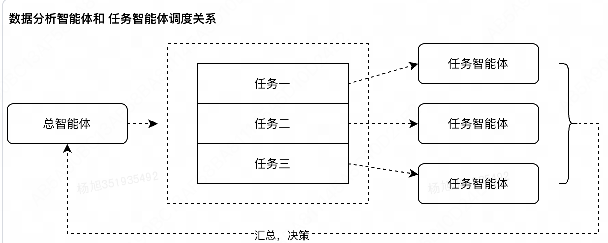
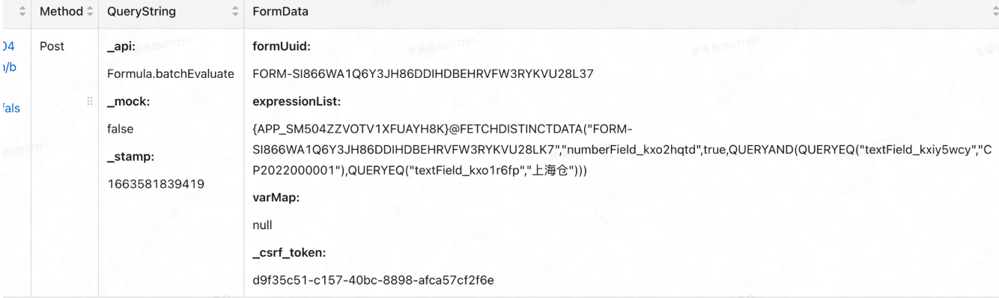
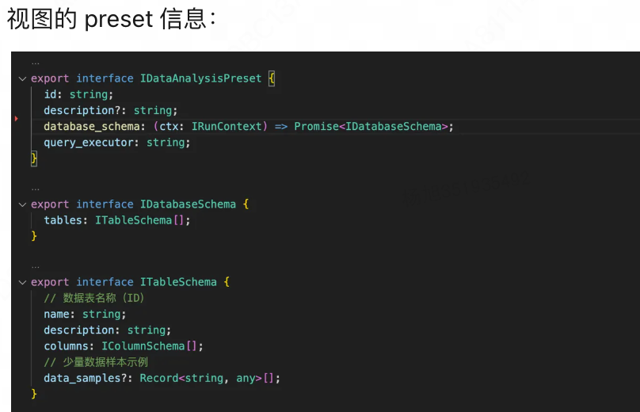
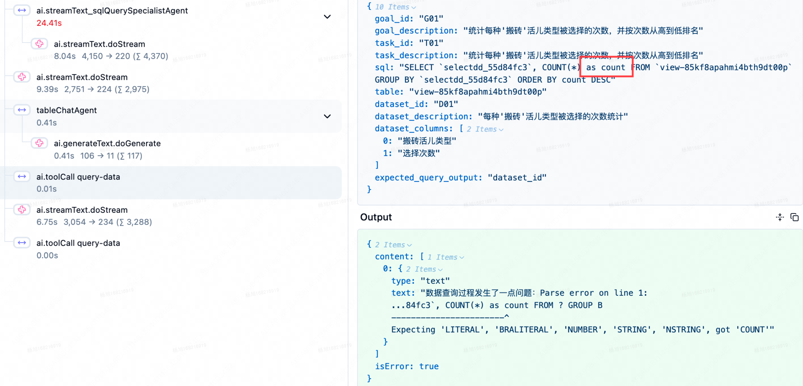
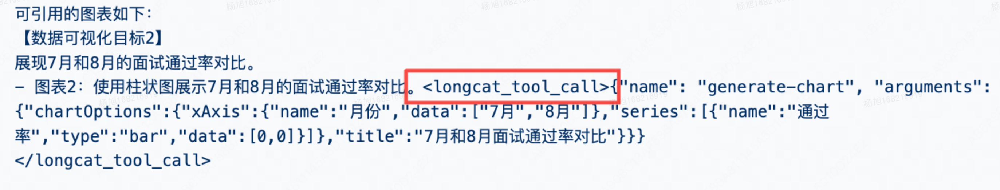
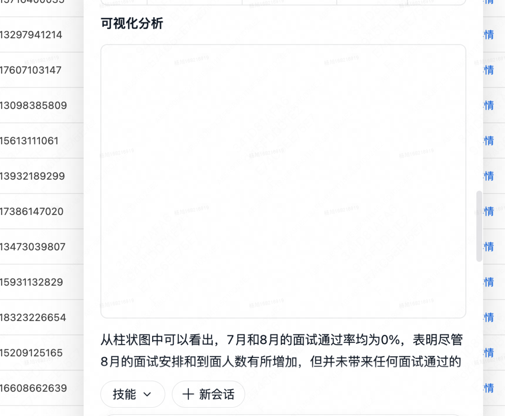
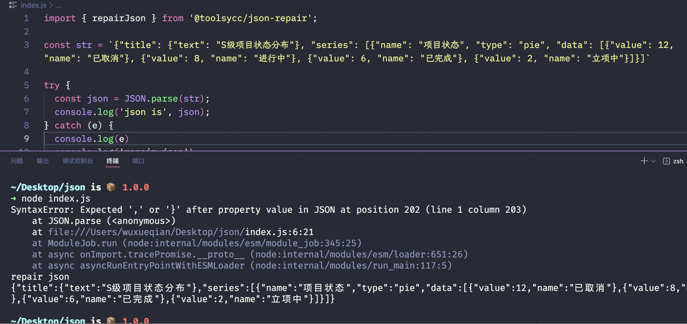
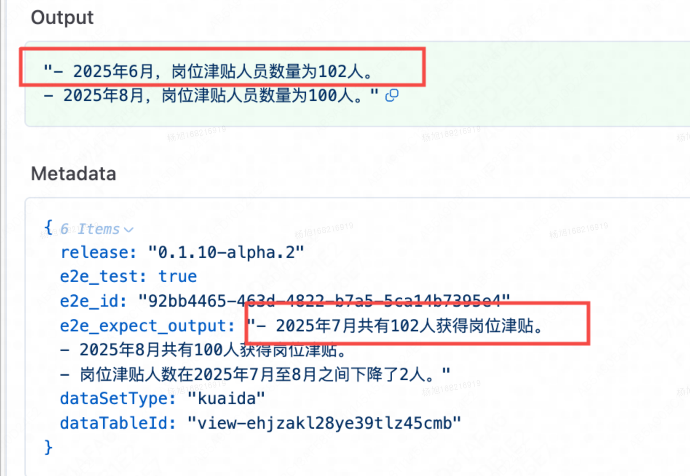
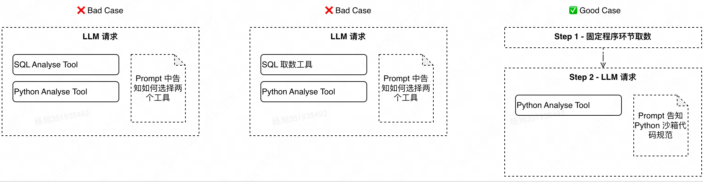

## Agent 架构

采用多 Agents 的方式，确保各 Agent 职责更明确，可分开设置指令，指令遵循更好
子 Agents 通过 tools 的方式接入到主 Agent，完全实现由 LLM 的调度
提供数据接入、绘图、数学计算、日期格式化等工具供 Agent 调用

1. 数据分析Agent（kuaida-agent），重点分支：
   - 初期demo版本：release/M6 【HITL-工具调用sql需要确认】
   - 支持引用人员、多步骤规划：feature/CLRXO-90917585/update-ui（8月份，0807）
   - 基础版本：release/0811、release/0826
   - 升级mastra：release/0909
   - 大量问题优化：release/0916、

2. 为什么不用标准 EventSource，而是用fetch+post请求模拟 SSE ？
   - 核心原因：EventSource 只支持 GET，不能带 body
     - 发送一个消息需要携带 messages、会话 id 等字段，必须放在 body 里，因为消息内容可能很长（几千 token 的上下文），放 URL 里会超长，以及包含文件附件、结构化数据，URL 参数无法承载

### 多 Agent 设计考量

[参考](https://www.anthropic.com/engineering/multi-agent-research-system)
优点：① 自主选择上下文，降低模型干扰（任务智能体不需要所有的 总智能体上下文） ② 降低模型 token 限制问题 ③ 并行执行，响应快

### 一些细节

设计了固定的 JSON 风格的数据查询 DSL，该 DSL解析为数据库/查询框架支持的查询语言（例如 SQL，或者后端的查询接口入参）
使用内存数据库和查询框架，一次性拉取全部数据，服务后续所有查询
可视化图表同时生成 SVG 和可交互的自定义块（Markdown 扩展语法）两部分，前者用于最终报告引用，后者用于对话中渲染
使用内存 S3 存储生成的图表、HTML 文件，并暴露访问地址

#### 表单类产品通用 DSL 查询

视图的查数表达式： 宜搭设计的通用数据操作 DSL

### 使用方向

数据分析场景：统计查询（1329-60%）、报告生成（327-14%）、趋势查询（80-3.6%）、对比分析、相关性分析（37-1.6%）、预测分析（37-1.6%）
query：

1. "请按照四个模块内容总结，一、基本信息，包含巡查背景介绍（自定义编辑）、巡查时间、城市、巡查人员、巡查商名单；二、巡查日志记录，即明查日志、暗访密录、随行见闻录的概括总结；三、风险预判，根据是否发现风险问题以及舞弊风险类型进行概括，四、下一步计划，支持自定义修改编辑。请筛选组别是职能和keeta组所有的巡查记录，按照以上要求生成报告。"
2. "分析恒彩装饰品牌以下5家门店11月各门店环比数据：恒彩家装·品质整装（集团店）、恒彩家装·品质整装（萧山店）、恒彩家装·品质整装（城东店）、恒彩装饰（奉化分店）、恒彩装饰（海曙店）。优秀门店有哪些？问题门店有哪些？持平门店有哪些？优秀点和问题点分别是什么以及优化方向。"
3. "请帮我统计石家庄地区，部门是`/金融服务平台/资产管理/内催作业/石家庄内催` 的实时人力情况，按照如下需求\n\n1、请制作表格，分别是 地区、类别(岗位中包含`催收`描述的则为一线，其他是二线)、岗位、实时人例（在岗人数）\n\n2、输出该地区当前在岗总人数"

### 聚类主题提取效果较差

当前实现：
对文本进行分词（jieba）
Top N（一般比较小， 比如 5 ）词频问题以及代表性评论统计
大模型总结核心问题. 直接给出答案

### 对比竞品

豆包：
数据源：单一Excel
✅ 数据分析 - Python Panda
✅ 数据可视化 - Python pyplot
我们：
数据源：Excel、快搭业务视图（通过预设模板 + 实现查询 DSL 接入）
任务规划：规划展示&修改
✅ 数据分析 - Python Panda
✅ 数据可视化 - Echat 图表 ，前端可交互

## 共创问题

- 时间戳转换日期错误
  - 当处理时间戳（timestamp）或日期（date）字段时，务必使用日期字符串作为比较值
  - **当处理时间戳（timestamp）列的查询时，请务必将用户意图通过 "UNIX_TIMESTAMP", "STR_TO_DATE" 等函数转化成时间戳再进行对比**
- 单轮会话：逻辑错误、无法理解月初在岗人数、
  - query：统计下 9月初在岗人数、统计下 9月初 内催判定列为内催的流失率, 请按地区分组统计
  - 意图：9月初在岗员工数量 = 9月1日之前入职且当前在职 或 (9月1日之前入职 在9月1日之后离职)
  - 结果：生成的SQL查询不对：
- 查询sql列名未加 ``， count 关键字冲突
  - query-data查询sql原语句："SELECT`selectdd_ss1234e9d`, COUNT(\*) as count FROM `view-86kfbaphami4th9dt00p`GROUP BY`selectdd_ss1234e9d` ORDER BY count DESC"
    
- Echarts 图标不展示，模型吐出了longcat tool 字样，破坏了tool call的结构
  -  
- 图标生成错误，模型生成的 JSON 少了个闭合大括号
  - 添加JSON修复工具，
  - Echarts 渲染抛异常：try/catch echarts的渲染，最终完整配置结构能正常渲染即可
- JSON标签未闭合（中括号、大括号使用多处错误）
  - 暂缓处理，需要考虑是否要强制结构化提取或提取失败的整体策略，JSON_repair？
- SQL查询幻觉，列ID错误，右值不对，处理低信息密度高复杂度的随机ID类常见的幻觉问题（强化提示词，未处理）
  - 基本都是靠提示词约束：
    - **DISTINCT 逻辑约束**：
    - **默认原则：** 除非任务逻辑或用户需求**确实需要**唯一值，否则**禁止**使用 `DISTINCT` 关键字。
    - **逻辑判断依据：** `DISTINCT` 仅在以下情况**之一**被允许使用：
      1.  **计数唯一实体：** 当目标是统计**不同**或**唯一**的实体数量时（例如：`COUNT(DISTINCT \`user_id\`)`）。
      2.  **明细查询要求去重：** 当查询目标是获取**唯一**的实体列表或属性（例如：查询所有**不同**的城市名）。
      3.  **用户明确提及去重：** 用户的自然语言中明确包含“去重”、“不重复”、“唯一”等关键词。
    - **严禁**将 `DISTINCT` 应用于不需要去重、或已经使用 `GROUP BY` 进行分组聚合的场景。
- python 时间计算问题
  - 
- 未能正面回答问题，回复偏移
  - 提示词优化：增加规划阶段思维链对最终步骤的产出要求思考
  - 工程优化：Python 写报告的步骤注入用户原始query描述
- 人员信息markdown渲染

## 工程优化实践终语

在数据分析 Agent 的交付过程，没有传统意义上的测试环节，核心思考是传统的单次人工回归无法覆盖模型输出的随机性，难以真实反映 Agent 的交付质量，为此，我们通过 PlayGround 和 Automated Eval 的单用例批量评估来完成工程的测试验收，将评价维度从“偶然成功”转向“确定性成功”。这种工程验收方式契合数据分析场景下用户对于结果准确性/一致性双重要求

## 四、经验教训&实践心得

### 一、模式选择： 预设流程（Plan-and-Excute） VS 动态思考（ReAct）

数据分析 Agent 在 25 年9月时，我们基于可选的内部模型 LongCat-Flash 、LongCat-Large、DeepSeek V3 做了一个架构选型 Plan-and-Exucte 来满足用户的复杂任务（比如帮我统计下各二级部门预算执行情况，然后再帮我看下超预算 Top 3 的子类是什么，需要做规划 + 多个任务，并且多个任务之间还有产物依赖), 中间也尝试优化了多轮：规划前加强思考、引入外置规划 SOP 辅助规划、提供了数据探查工具等，尽管做了很多弥补但是最终效果仍差强人意: 主要体现在 ① 归因问题上无法下钻 ② 复杂的多步骤任务无法持续稳定输出正确答案直到 LongCatFlash 2512 版本出现，并进行 Agent PlayGround 评测时，发现从预设流程的模式调整成动态思考的模式在黄金用例集上的准确率和稳定性都有更高的得分

### 二、Agent 上下文工程治理经验

在 Agent 实践中， 除了流程模式的选择之外，另外一项最重要的便是上下文工程治理， 我们除了在工程上对多 Agent 采用了上下文隔离&可选共享的方式， 也在整个 Agent 的上下文提供中有踩过一些坑，分享如下：

1. 在一个模型请求上下文中提供功能边界不重复的工具
   数据分析 Agent 的业务演进上，是先满足用户简单的分析需求（统计某一天的数据量、聚合画图等），因此在 8 月 Demo 时实现了 SQL Analyse Agent，随后 9 月加入了 Python Analyse Agent 时，并未移出 SQL Analyse Agent， 而是采用了让模型2选1的形式，很快生产的会话意图上就发现了问题，又尝试将 SQL Analyse Agent 降级成取数工具（不参与分析）， 但模型仍然无法很好的将任务划分成 SQL 取数、Python 分析这个理想的步骤，直到后续在流程上直接分离，单独步骤取数，单独步骤 Python 分析后，效果上符合预期
   
2. 模型肌肉记忆问题
   我们早期过于乐观估计大模型对于 Prompt 指令的遵守程度，提供的 SQL Tool 能力语法上无法完全 Match MYSQL 8.0, 因此给了一些蹩脚的约束（比如 Prompt 中约束SQL 语法不支持窗口函数，时间类型比对需要注意事项等），后续持续的生产低分会话告诉我们：在有限的场景中尝试"逆转"模型的编程惯性或许可行，但无法完全应对所有的未知场景，因此我们在工具和上下文提供时，一定要顺着模型训练分布来选择供给
3. 提供更适合业务场景的上下文
   在我们选择提供给模型的上下文信息时， 应尽可能将用户看到的内容转化成信息传递给大模型， 比如用户在多维表格中看到列月份 数据是2025-12-01, 但由于程序获取到的数据格式是时间戳，我们不应让模型去处理时间戳，而应该在程序层面将数据处理成用户看到样子（2025-12-01) ，然后再交由 LLM 处理. 同样的有 "将第一个视图的XX列复制到第二个视图"、"请计算K列的平均值" 等此类用户意图均是数据形状中需要体现 "第几个视图"、"K列" 等信息
4. 模型的"惰性"和应对经验
   在多维表格分析与建表的复合任务场景中，我们显著观察到 ReAct 模式因上下文累积导致的响应迟滞现象。以数值列阈值判断为例：当需要将大于7000万的数值标记为"大于七千万"，其余标记为"小于等于七千万"时，该任务涉及先导数据分析和后续表格写入两个阶段。实践发现，在完成首阶段数据分析后，ReAct机制常出现流程提前终止的推理缺陷。为此，我们设计了一个轻量级write_todos工具，通过模型自主管理写入任务的状态看板，将其作为ReAct推理提示词的固定组成部分。在用例测试验证测试中，该方案使后续操作意图的识别准确率从87%提升至近乎100%
5. 业界最佳实践的探索和应用（上下文结构化 + 追加 （KV 缓存））
   在数据分析 Agent 的生产级实践中，Prompt 的组织方式直接影响模型推理的稳定性和推理成本。我们基于业界的最佳实践，采用了一种清晰的三层结构化布局：
   **顶部**：用户原始意图（User Query） 将用户的原始问题完整置于上下文最上方。在 ReAct 多轮交互中，随着 Observation 的累积，模型容易偏离初始目标。将 Query 固定在首位，可持续强化任务主线，有效减少推理走偏。
   **中间层**：动态推理轨迹（ReAct Observations） 该部分包含按时间顺序追加的历史 Action → Observation 记录，是上下文长度增长最快的部分。采用从旧到新的排列顺序，符合大多数模型的注意力处理偏好。 通过统一的 XML 标签（如 <observations>）对轨迹整体包裹，可有效隔离中间内容，避免冗余 Observations 对顶部指令和底部元数据的干扰。
   **底部**：数据集资产元信息（Dataset Assets） 将表结构（Schema）、字段类型、数据分区状态等关键资产信息统一放置在上下文末尾。 虽然在会话中资产元数据可能因新数据产生而发生更新，但其变化频率和体量远低于 Observation 部分。置于末尾可作为生成下一步行动前的最后一次字段对齐参考，降低模型生成幻觉字段名或错误列引用的概率。
   该结构对 LLM 提示词 KV 缓存机制非常友好：
   - 顶部 User Query 几乎全程静态，可完全复用缓存；
   - 中间 Trace 按顺序线性追加，只有新增部分需要增量计算；
   - 底部资产信息更新频率低，缓存失效范围可控。
     在 ReAct Loop 长上下文场景下，合理的结构化布局通过清晰的分层与隔离，能够实现模型行为更可预测、推理路径更收敛、以及推理速度和 token 消耗更可控
