## 项目介绍

### 项目介绍、负责哪些模块、重难点及解决方案

#### 数据分析Agent

ttagent 前期开发，做了工单目录匹配RAG搜索，后面负责做了沙箱接入，提供给agent用来执行skill管理安装和调用，代码执行，以及分用户分租户搭建沙箱内agent工作区workspace，支持上传文件，执行skill等操作。后续被同事封装成Java版本，提供RPC接口供学城Java后端调用

- **Vercel AI SDK 6** 构建生产级 Agent [文章](https://cloud.tencent.com/developer/article/2685429)
  - 基于 AI SDK 的工作范式：
    - 顺序处理（Sequential Processing）：连续调用streamText
    - 路由（Routing）
      - 场景：根据用户咨询类型（退款、技术支持、一般问题），分配给不同处理逻辑或不同大小的模型
      - 实现：先generateObject意图识别输出分类classification，再根据分类提示词调用streamText输出结果
    - 并行处理 (Parallel Processing)
      - 场景：代码审查（Code Review）。同时从“安全性”、“性能”和“可维护性”三个维度进行审查，最后汇总
      - 实现：使用Promise.all()请求多个不同提示词的 streamText，再汇总
    - 编排者-执行者 (Orchestrator-Worker)
      - 场景：实现一个新功能。编排者决定需要修改哪些文件，执行者分别去写每个文件的代码
      - 实现：generateObject拆分规划任务，streamText实现
    - ReAct 模式，评估-优化循环 (Evaluator-Optimizer)
      - 循环控制 TooLoopAgent：[文档](https://juejin.cn/post/7605769126271549486?from=search-suggest)
        - stopWhen：终止条件，可传入函数，比如：token 消耗超限终止循环
        - prepareStep：在循环的每一步发起大模型请求前运行，可以实现高度智能的动态行为
          - 根据 step > 3，切换到强模型；或者调整可用工具及调用规则
          - 上下文剪裁：messages.length > 20，滑动窗口裁剪只保留最近 10 条记录

#### 性能测试（Puppeteer、首屏性能优化）

**目标**：快搭表单设计部分存在性能上限，随着快搭稳定性建设的推进，需要进一步看清、关注表单搭建侧性能问题，保障快搭的稳定性，防止随着迭代进行性能降低。尽量避免会导致性能变差的改动在优化前就上线，影响线上的性能（FPS、FMP）导致潜在客诉风险
定义快搭场域下的测试场景
分场景给出性能指标定义
通过用例给出显现卡控的基准值

**运营机制SOP**：
快搭方案：每次测试后需预留一部分时间解决问题，防止指标超限时来不及处理，小版本测试方案见 快搭小版本发布性能测试方案，使用单独的工作机进行性能测试
学城方案：发布当天上午跑一次测试，遇到问题能解决就解决，不好解决就推迟上线
表格方案：每周三晚学城 st 合并发版本完成，使用合版本的分支进行性能测试，有问题第二天上午解决

**执行流程**：
测试工具由 Master 和 Runner 两个项目组成，具有用户操作界面，目前表格通过一台专用测试机跑测试，本地持续运行 Runner，每隔 2min 向 Master 发起轮询，查询是否有测试任务，有则执行，无则等待；可以同时启动多个Runner，实现并行消费任务 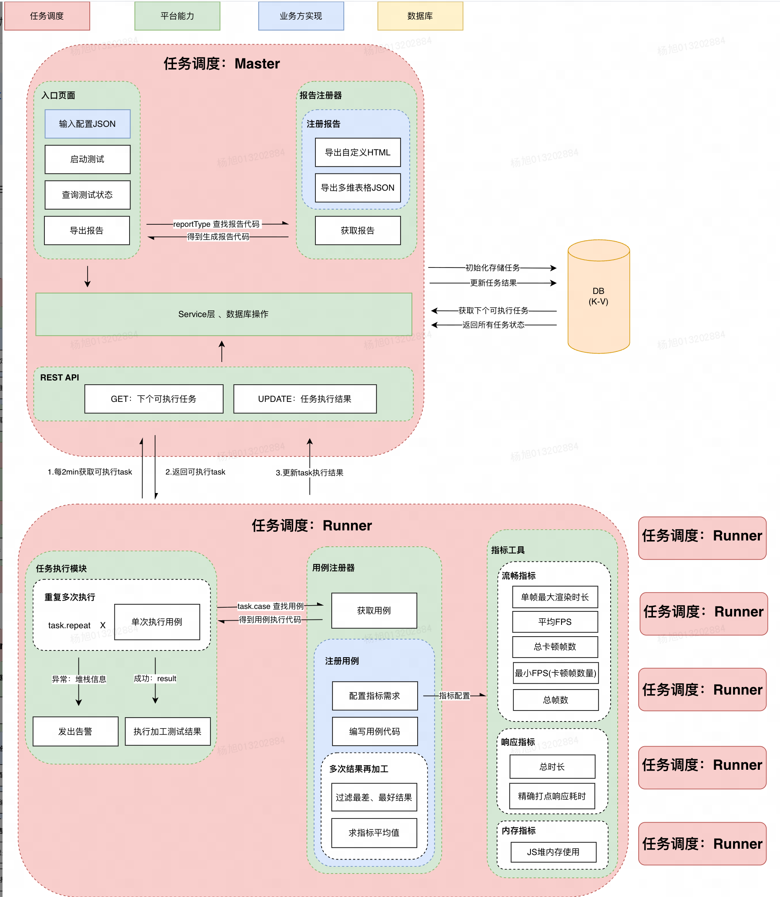

- Master-服务器
- Runner-客户端
  Runner 内置了已经定义好的测试 case，并抽象成了对应的 case 类，统一继承基类 BaseCase，表格场景下有：CanvasScrollCase-滚动性能、ModelPerformance-模型性能、GroupCase-分组功能等用例

  ```ts
  export abstract class BaseCase {
    private _result: any[] = [];
    init() {
      this._result = [];
    }
    // 负责用例执行
    async execute(page: Page, params: any = {}, repeatStep: number) {
      console.log('正在执行用例：', this.getKey());
      const ret = await this.onExecute(page, params, repeatStep);
      this._result.push(ret);
    }
    // 负责处理结果
    processResult(caseParams?: any, urlParams?: any) {
      return this.onProcessResult(this._result, caseParams, urlParams);
    }
    // 获取caseKey
    abstract getKey(): string;

    protected abstract onExecute(page: Page, params: any, repeatStep: number): Promise<any>;
    protected abstract onProcessResult(result: any[], caseParams?: any, urlParams?: any): any;
  }
  ```

  内部定义了`MetricToolkit`类，用于处理和收集用例执行过程中的 `averageFPS`、`memoryRange`、renderTime 等指标结果。
  轮询测试任务，拿到任务配置，进而执行测试用例 `ITask`

  ```ts
  interface ITask {
    projectId: string; // kuaida
    taskId: string; // 任务id
    caseKey: string; // 用例
    caseParams?: { [key: string]: any }; // 用例执行需要的参数
    url: string; // 浏览器访问地址
    urlParams?: { [key: string]: any }; // 浏览器访问地址参数，会帮忙拼接
    reportParams?: { [key: string]: any }; // 导出报告使用的参数
    repeat?: number; // 该任务重复测试次数
    taskConfig?: {
      viewport: {
        // 视口大小
        width: number; // 2048
        height: number; // 1280
        devicePixelRatio?: number; // 默认2
      };
      autoClose: boolean; // 是否关闭窗口
    };
    copy?: boolean; // 是否要复制一份
  }
  ```

- 指标说明：
  - 流畅维度（记录一段时间内的RAF列表）
    - 单帧最大渲染时长（maxRenderTimePerFrame）：列表里的最大值
    - 最小FPS（卡顿帧数量 worstFrameData）：统计连续大于 100 所消耗的时间对应的FPS，比如【20,200,100,20】，则卡顿帧平均耗时：（200+100) / 2 = 150ms，最终结果为（7FPS/2帧）
    - 平均FPS（averageFps）：列表的累加 / 列表的个数
    - 总卡顿帧数（jankFrameCount）：列表里 > 100 的个数
    - 总帧数（totalFrameCount）：列表里的个数
  - 响应维度：总时长、渲染时长（表格业务代码打点ZRender的绘制时间）
  - 内存维度：内存变化（memoryRange）：操作前，主动调用垃圾回收，获得JSHeapUsedSize。操作后，主动调用垃圾回收，获得JSHeapUsedSize
- 性能测试置信度验证：
  - 下表主要对审批中心的首屏性能进行多次重复测试，每个单独的测试环节中包含 30 次重复测试，取 30 次测试结果的平均值作为最终输出，用来衡量各指标的波动情况，如下：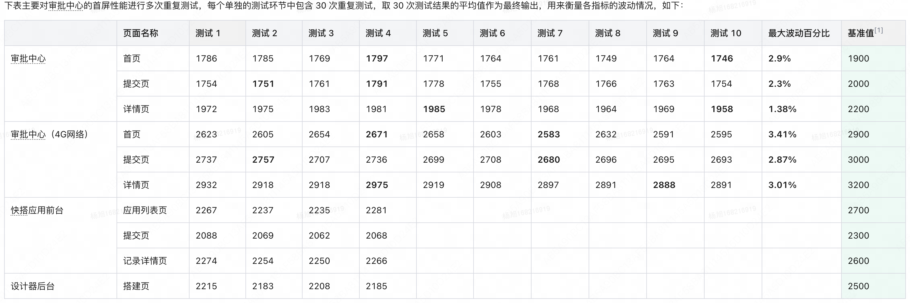
  - 测试结果表明，性能测试平台输出的结果比较平稳，整体误差 3% 左右，4G 网络整体波动大于 WIFI 环境
  - FST 准信度测试：
    页面 fst 结果主要受资源大小、DOM 变化、接口耗时影响，线下通过模拟这些因子变化进行测试结果对比，验证测试结果的稳定性及有效性，测试过程如下：
    - 工具是否能够准确识别网络请求差异：
      用例：首先对提交页正常测试一次，然后对页面中业务接口请求数据进行mock处理，即去除接口请求过程，再次进行测试，保证两次测试仅有接口请求差异 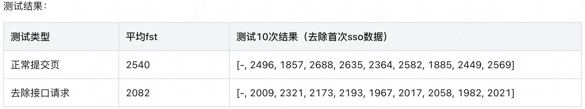
      结果：​去除接口请求后，测试结果变好，符合预期
    - 工具是否能够准确识别 DOM 渲染差异
      用例：以去除接口请求后的测试数据作为对比，在此基础上增加表单渲染，即提交页修改为渲染两份表单，进行测试 
      结果：增加页面 dom渲染后，测试结果变差，符合预期
    - 工具是否能够准确识别 资源差异带来的影响
      用例：以去除接口请求后的测试数据作为对比，在此基础上额外引入 echarts 库，并渲染一个基础饼图，模拟页面请求资源变大场景，进行测试 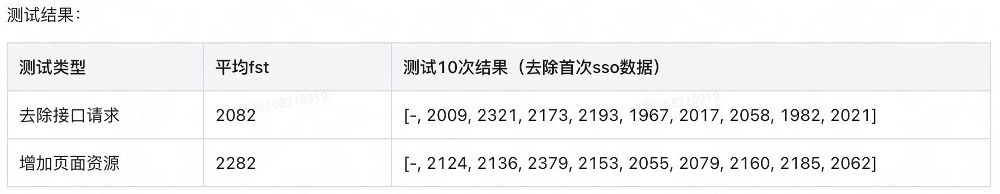
      结果：页面资源增加后，测试结果变差，符合预期

测试机制：

1. 测试环境：统一在外接显示器上进行(新款mac刷新率最高120Hz，会放大fps指标)，保持电脑只开启 vscode 及浏览器执行自动化测试用例，无其他资源占用
2. 测试时机：
   发布 release 后进行首次测试，st 合版后二次测试，与指标基准值比对决策是否卡控上线
   每次迭代除进行本迭代性能测试外，同时要对上一版本测试，保证两次迭代测试环境相对一致，使版本对比结果更准确
3. 输出报告：
   在当前目录下创建每个迭代的性能测试报告文档，报告格式见v1.9性能测试报告，在执行测试用例过程中如出现**阻塞性场景、输出报告中指标超出基准值时视为性能测试不通过 ❌**
   - ❌ 性能测试不通过：
     - 对该场景重新测试确认，同时研发介入判断性能问题严重程度，进一步定位原因，如不阻塞发布可正常发布，否则需要治理
     - 若因为业务迭代导致指标超出基准值上限，但业务侧仍需上线，需要周知@guan@Jerry Ma进行审批方可上线
     - 问题处理举例：
       阻塞的性能问题：引入的问题是黄金链路，需要修复或移除引入问题的需求
       边缘场景：为了保证整体稳定性，需要定位原因，评估影响并跟进
       常规性能问题：业务代码增加导致的性能问题（连续两个迭代异常后重新测试并更新基准值）
   - 性能测试通过：
     存在性能测试通过，但测试结果相比上一版本有波动场景，以下两种情况也需要配合需求开发者进一步定位、分析原因，防止性能渐进裂化到异常状态，无法及时发现和治理：
     - 连续两个版本及以上相比前一版本超过5%的波动
     - 相比上一迭代超过10%的波动
4. 指标基准值：有两种实施方案
   - 多次测试（10次）取性能最差的结果然后设置一个波动范围作为基准值（学城采用），需要分析并排除多次测试结果中明显异常的数据。
   - 多次测试取指标平均值，需要排除异常数据，基于该平均值设置一个波动范围作为基准值 **快搭采用**
     - **基准值选取原则**
       1、平均FPS，选取10次测试结果中最低的一次（这里不取平均值的原因：性能测试结果相对稳定的情况下，平均值和最低值的差距不大，取平均值的情况下则需要增大合理的误差范围），去除小数部分后再减1（误差值）作为基准值，例如58.62则选取57作为基准值
       2、单帧最大渲染时长，选取10次测试结果中最高的一次向上取整到10位整数，再加上50ms（误差值），例如测试得到195ms，则取250ms作为基准值
       3、根据单帧最大渲染时长计算最小FPS作为基准值，例如单帧最大渲染时长为250ms，则最小FPS的基准值应为1000ms/250ms = 4
       4、卡顿帧数，选取10次测试结果中最高的一次向上取整，取5的倍数，再加上5（误差值），例如测试得到卡顿帧数量为13，则取20作为基准值
5. 组件类型说明：
   以100组件为基准，200组件-500组件依次递增相同的组件类型，以看清性能变化趋势
   - 100组件：单行文本x4、多行文本x4、数字x4、金额x4、...
   - 200组件：单行文本x8、多行文本x8、数字x8、金额x8、...
6. 基准值定义及报告说明
   **快搭线下性能测试单一场景耗时较少，能够重复多次测试，这里基准值的定义暂定取平均值方案，来容错异常数据，提高指标的鲁棒性，按照上述两种基准值测试方案制定的基准值如下表：以下文中日程按钮组卡顿测试举例，两种基准值定义均能反映出性能问题**
   重点关注：单帧最大渲染时长、平均FPS，作为严格卡控指标，超出基准值分析原因，判断风险，决策能否上线
   辅助参考：卡顿帧数、总帧数、内存占用、首屏时间指标主要用于辅助判断，不作为上线评判卡控，超标时可根据情况分析
   测试用例执行次数：每个测试任务重复10次
7. 测试指标包含：静态指标和动态指标
   动态指标：组件选中、组件添加、组件复制、组件编辑、属性编辑、组件拖动、0-500组件添加内存变化、
   静态指标：和渲染器首屏、设计器首屏、渲染器表单解析时间、审批中心首屏 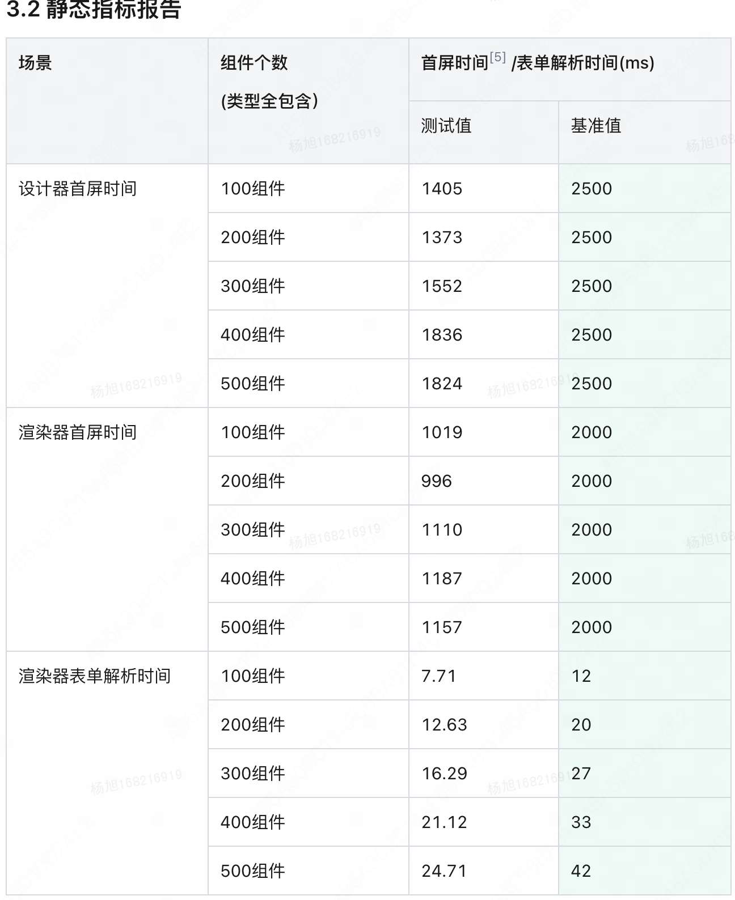
8. 测试异常值处理：
   - 多次测试发现组件数量从100-500增加时，单帧最大渲染时长波动增大↑，偶现异常数据，但最大值和最小值差值总体保持在100ms内，平均FPS相对稳定，总体误差在5内
   - **方案**：针对单帧最大渲染时长异常数据，最终输出的单帧最大渲染时长结果采取移除最大值和最小值后取平均的方式输出，减少异常数据的影响，多次测试表明输出结果的稳定性得到提高
   - 测试首屏时间时发现，sso重定向时间会被统计到首屏时间内产生影响，以及环境问题、网络原因加载较慢也会导致首屏数据异常
   - **方案**：计算10次测试结果的平均值，超出平均值500ms的数据会被忽略，然后基于相对稳定的测试结果取平均值输出

性能报告举例：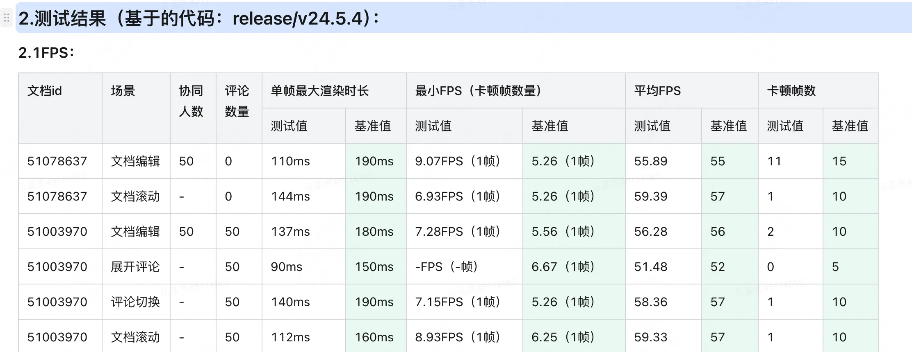

最低性能指标（基于代码分支：release/1.6）：

1. 针对当前测试的场景每个场景都测试10次
2. 理论上每次测试的结果应该是比较稳定的，单帧最大渲染时长误差（最大的减去最小的）不应该超过100ms，平均FPS误差（最大的减去最小的）不应该超过4，如果超过，可能是测试脚本有问题，需要排查。误差的阈值是根据历史测试的正常情况数据估计的，如（测试最低性能指标相关配置）
3. 基于测试结果
   - 平均FPS，选取10次测试结果中最低的一次（这里不取平均值的原因：性能测试结果相对稳定的情况下，平均值和最低值的差距不大，取平均值的情况下则需要增大合理的误差范围），去除小数部分后再减1（误差值）作为基准值，例如58.62则选取57作为基准值
   - 单帧最大渲染时长，选取10次测试结果中最高的一次向上取整到10位整数，再加上50ms（误差值），例如测试得到195ms，则取250ms作为基准值
   - 根据单帧最大渲染时长计算最小FPS作为基准值，例如单帧最大渲染时长为250ms，则最小FPS的基准值应为1000ms/250ms = 4
   - 卡顿帧数，选取10次测试结果中最高的一次向上取整，取5的倍数，再加上5（误差值），例如测试得到卡顿帧数量为13，则取20作为基准值

**性能工具校准及优化**：
**背景**
目前线下测试工具的首屏性能测试波动较大，影响了结果的准确性和可信度，需要分析原因并校准
**目标**
完成首屏性能的准信度校准，提高工具可用性，监控迭代性能劣化
**行动**

- 性能校准：过滤掉首次登录的 sso 耗时，过滤异常抖动数据，模拟接口请求、DOM 变化、资源大小多个维度测试，验证工具有效性
- 自动化建设：线下对齐并接入天翔老师建设的办公性能测试平台，实现用例创建 - 执行 - 查看报告的全链路自动化，提升测试效率
- 平台稳定性验证：基于测试平台多次测试首屏性能，给出平台侧波动范围（约3%以内），理论上性能劣化超 5% 的变化能够检出
- 进一步扩展审批中心相关页面首屏测试用例，监控首屏变化趋势

**结果**

- 接入测试平台后，大大降低了性能测试成本，并且方便性能优化后的对比测试
- 在近期的一次迭代中，由于测试执行时间不当，未能及时检出性能劣化问题。目前已规范测试执行时间，保障卡控

#### 低代码引擎错误治理

**背景：**目前快搭表单设计侧，存在一些操作，会导致schema数据不合法，导致前台渲染时，存在一些异常。具体可以raptor中表单功能异常、表单hooks异常。raptor上无效告警较多，不利于排查问题，需要进行引擎问题修复处理这部分报错。
**目标：**1）raptor中表单异常告警清0：解决《引擎功能报错》一些存量问题，避免后续有新增问题时，无法感知。2）增加相应的能力（schema检测、规范等），避免已知问题在后续的开发中继续发生。3）治理完成后，增加 线上引擎功能报错 的监控，及时感知增量问题并治理。
**现状：**表单功能报错异常错误出现率较高，影响用户体验，平均周告警数量500+，影响用户数20+，主要包括以下场景：上报错误类型 proptype ：formula显示条件、datafilling数据填充
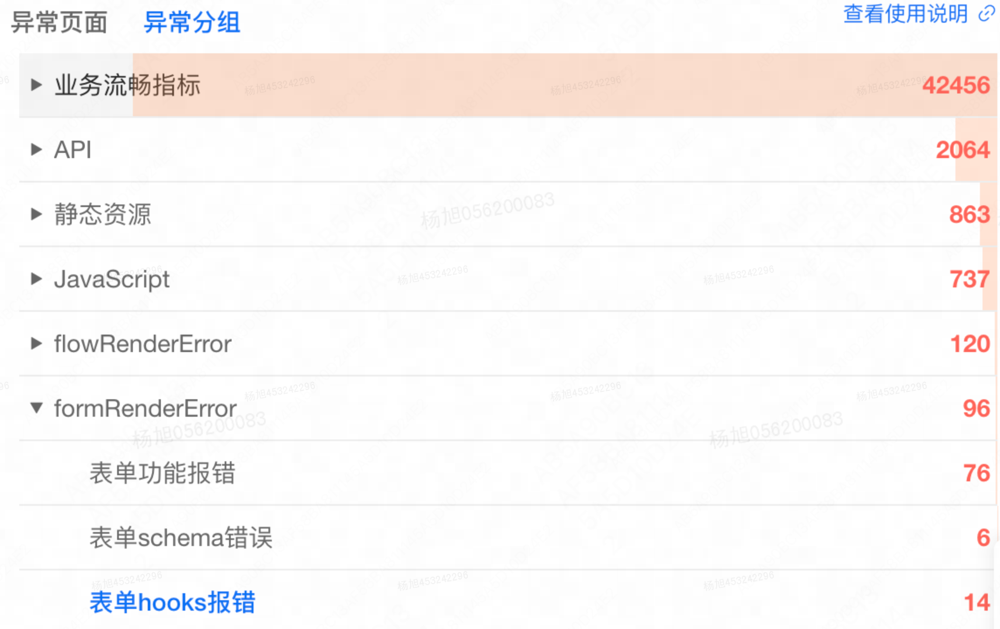
**引擎告警问题产品方案对齐：**对当前引擎报错进行分类和分析如下图
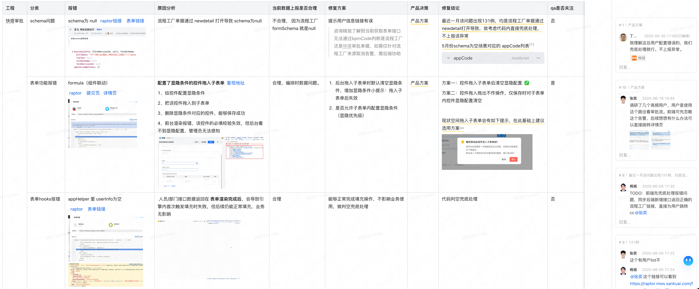 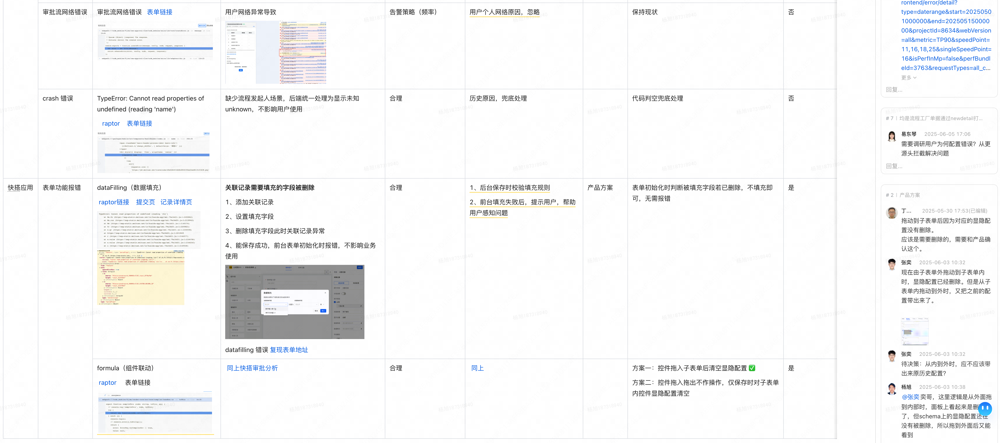
**引擎告警错误修复方案：**

1. 配置了显隐条件的控件拖入子表单时需要清空显隐条件
   **根因**：首先给控件配置显隐条件，然后把该控件拖入到子表单，删除该控件显隐条件所依赖的控件，此时能够保存成功，前台渲染在解析表达式时报错控件不存在，抛出异常 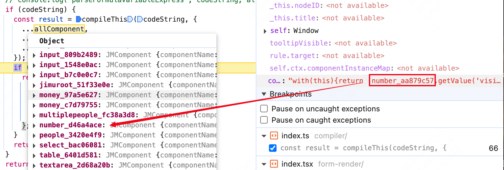 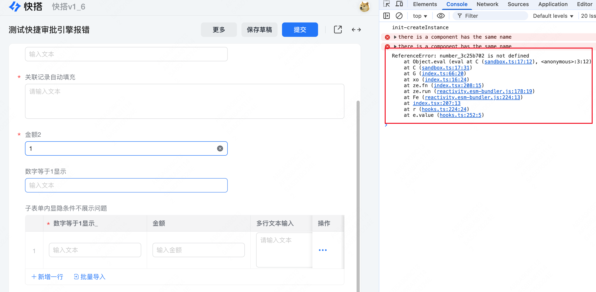
   **方案**：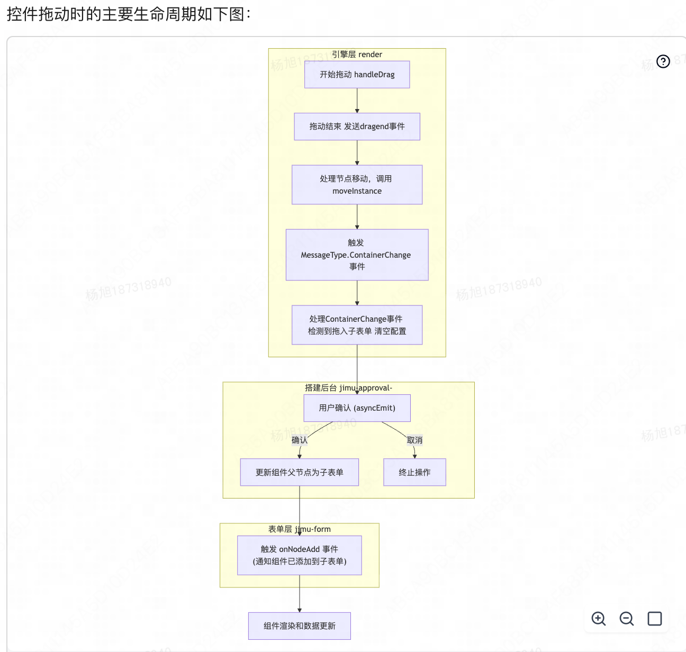 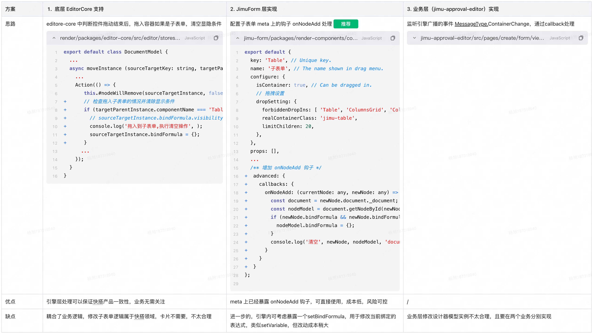
2. 关联记录在需要填充的字段被删除时引擎解析报错处理
   **根因**：在解析组件props进行数据填充时，如果对应控件已删除，在componentInstanceMap中无法正确获得实例，即targetComp为空，在执行autoDataFillingHandler时内部报错。因此判断如果没有控件，无需执行 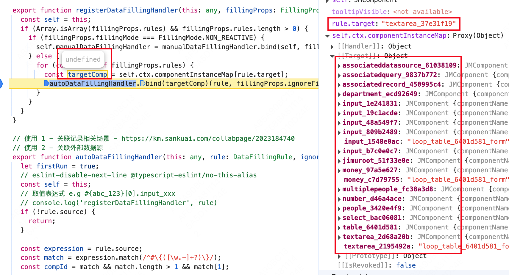 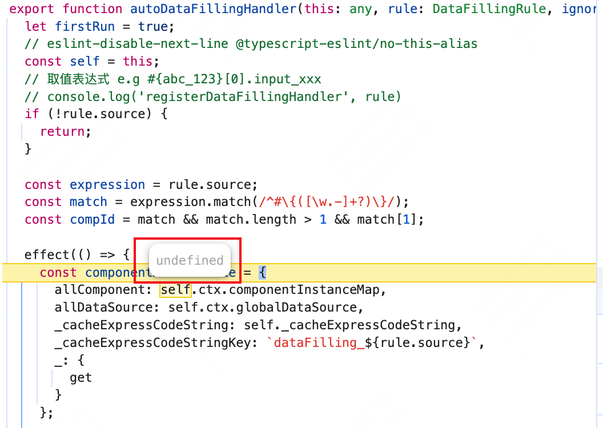
   **方案**：registerDataFillingHandler 函数内部判断如果控件已删除，不触发填充 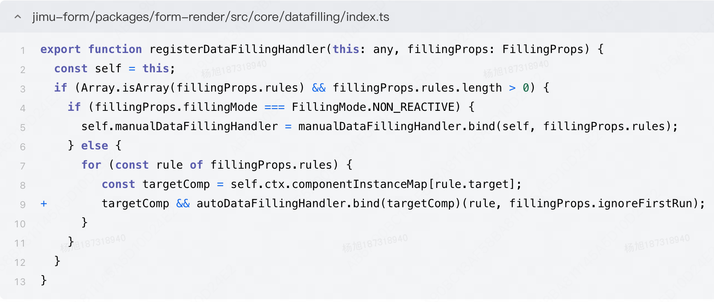

**行动**：

1. 梳理存量告警问题，逐一复现错误，分析并给出问题根因
2. 异常可归类为以下类型：
   - 代码未兜底：属性访问时缺少判空，导致运行异常，补充兜底逻辑
   - 表单功能异常（核心问题）：主要因为管理员某些操作超出引擎功能设计预期，详细分析及治理方案见修复方案
   - 表单 hooks 报错（时序问题）：人员/部门控件异步接口数据返回晚于表单渲染完成，导致首次填充失败，不影响业务使用，增加兜底处理
   - schema 异常：通过脚本获取所有告警记录的流程来源，均是流程工厂单据链接打开有误，属用户操作，忽略该告警
   - 接口请求异常：个别用户网络原因，保持观察
3. 治理完成后，开启线上表单功能告警，监控新增问题

**结果**：

1. 所有存量功能报错已实现清零，完成告警降噪处理，保障业务稳定运行
2. 近期检测到一例新增告警，已跟进分析和治理，预计下周上线

**25年上半年总结与展望**：
表单引擎异常治理、性能工具校准及优化、审批进大象能力建设

上半年主要负责移动端审批中心的整体改版及表单引擎错误治理等事项，所有需求按时交付、保证质量，千行代码bug率：22 / 52176 = 0.422‰（移动端偏多）

开发过程中由于满足产品需求的快速迭代忽略了系统性能，当前已协助团队开始治理，后续开发时要更加注重思考接口设计问题，避免先污染后治理

增加审批中心移动端异常日志

#### 审批进大象跨端一致性（移动端MRN、大象端适配、Pike长连自动更新单据状态、微前端一体化）

**背景**：
pc 端能力增强：扩展 pc 端审批功能，提升产品完整性
移动端补齐短板：建设移动端审批中心核心功能，通过交互改版提升用户体验
**行动**：

- 接入 pike 实现待审批任务自动更新，完成审批设置改版，迁移审批授权，提高用户审批关注度
- 完成审批中心移动端一系列基础、易用性功能建设，包括快捷审批、流程分类筛选、30 天分层展示、帮助中心及审批设置等
- 解决线上比较影响用户交互的历史遗留问题，如筛选按钮响应失效等

**结果**：
移动端基础能力建设全面完成，提高产品易用性和用户满意度
开发过程中对接口性能问题重视程度不够，需要改进

#### 低代码开发（地址控件、时区控件、AI节点、连接器节点抽象、Dob响应式排查）

**地址控件**
**背景**
快搭表单缺乏结构化的地址信息收集能力，业务方（如行政、ERP、公司事务等部门）只能通过“单行文本”手动填写地址，用户体验不佳、数据格式不统一，难以实现数据有效性校验及上下游消费能力
**目标**
表单侧新增地址控件，并抽象出通用级联选择（Cascader）范式，提升数据在工作流及表单侧的消费能力
**行动**

- 对宜搭、明道云等主流产品的地址控件进行功能拆解，拆解数据结构，完成快搭地址控件-schema设计
- 进一步抽象出通用的级联控件类型Cascader，通过配置 snippet，可以快速生成不同控件，如Address、Meeting等，支持远程数据源配置，能够自动适配各消费场景
- 新增地址相关运算符：属于任一和不属于任一。通过上层注入的方式传入运算符，避免对 render-core 底层的直接侵入
- 针对移动端 ScrollPicker 组件 UI 不更新bug，给出两种方案：1）fork 源代码本地修改刷新逻辑解决；2）替换其他组件。建议并推动产品选择方案2，在不影响交互体验的同时降低维护成本
- 控件消费场景非常多，涉及显示条件、数据筛选、权限配置、工作流等多个场景，开发过程中全面盘点应用场景，及时暴露到QA和产品未识别到的应用场景，避免遗漏
- 控件 new 标签的处理：通过应用层注入标签配置信息，透传至底层物料插件，通过 snippet key 定制渲染，无需引擎层或 meta 结构调整，业务后期可灵活配置 AI、Beta、Hot 等标签样式与显隐

**结果**
本期地址控件按期交付，人天缺陷率 4/24 =0.167，交付质量较好，满足业务方诉求，大大提高了数据录入能力
基于本次实现的通用级联组件，后续可高效扩展如「会议室选择-上海市-互联D2栋」、「商品分类-品牌-型号」等级联类型的控件【扩展示例】

**AI能力建设**：

- 抽象出一套AI节点引用字段编辑器渲染策略，交互上对齐表单控件填写页，保障节点调用时的合规性
- 实现流式输出，实时接收响应内容并渲染为 markdown，提高用户预览体验
- AI节点支持多种输出格式（Markdown、JSON），且可被后续节点引用，实现多对多数据流转

**审批进大象多期建设**：支持滞留单据处理、设置多端同步、快捷审批、工具栏（流程分类、筛选、排序）、超30天任务分层展示等核心功能，显著提升用户审批效率（审批耗时减少 20%+ from PM）

**快搭应用复制能力**：支持同环境、跨环境复制整个应用及应用内单独表单和工作流的复制能力，大大提高管理员的搭建效率

**25年下半年工作总结展望**：上半年主要负责移动端审批中心的整体改版及表单引擎错误治理等事项，做到针对问题可以给出不同处理方案，整体需求按时交付、保证质量，千行代码bug率：31 / 114417 = 0.271‰

下半年主要支持了数据分析Agent前台开发、表单新增地址控件，以及工作流AI节点的相关功能开发，后面继续聚焦快搭AI能力建设，如快搭多语言设置支持AI一键翻译能力

表单引擎治理后，新增3例告警问题且已跟进治理完成，接下来会继续监控并处理

#### 24年工作

1. 快搭审批&快搭应用后台入口融合
   **背景**
   快搭应用计划在v1.5面向全公司推广，为增加“快搭应用”品牌曝光，实现统一的产品答疑及机器人问答等场景，需要完成后台入口统一
   **目标**
   完成快搭审批&快搭应用后台入口融合，收敛所有菜单功能，下线快搭审批后台入口

   **行动**
   - 完成快搭审批&快搭应用后台入口融合，收敛所有菜单功能，下线快搭审批后台入口
   - 【产品方案不定】调研对比微前端、链接跳转、iframe方案，决策采用微前端+链接跳转结合方案（见入口融合技术方案）
   - 划分项目路由：三个列表页独立，可直接通过微前端嵌入，避免重复开发；搭建页是一个复杂但独立的二级页面，通过链接跳转最为简单
   - 【跨域问题】分析项目的 Oceanus 、nest 配置情况：Oceanus 配置快搭审批路径的 nginx 重定向，nest 上配置快搭审批服务的 http 触发器，使得快搭应用域名能够访问到快搭审批服务
   - 【部署后子应用加载 404 问题】排查发现由于快搭域名的特殊性，同时部署了前台和后台服务；且 nest 上快搭审批服务实际配置在 https://kuaida.sankuai.com/approval 路径，导致子应用指向了快搭前台，入口修改为 https://kuaida.sankuai.com/approval 后访问正常

   **结果**
   - 按时交付，交付质量 3 / 8 = 0.37
   - 线上出现一例 nginx 配置导致的问题：用户流程更新后保存流程失败，报错 413 request entity too large，前后端一起排查发现 schema 体积过大。根本原因是 shenpi 域名有请求体大小 1000m 历史配置，kuaida 域名没有，默认 nginx 请求体大小只有 1M，修改 server 端全局配置解决。解决方法：1）server 端全局配置 client_max_body_size 1000。2）location 路径增加该配置

2. 快搭工作流支持创建大象群自动化节点
   **背景**：快搭工作流连接器节点用户感知较弱，自动化能力暴露不足，产品上进一步规划官方连接器、自定义连接器两种类型，将官方连接器作为独立节点外漏展示，便于理解和调用
   **行动**：前后端规范一套连接器 schema，扩展能力边界，如选人上下限校验；抽象标准连接器节点配置结构 PublicConnector，通过函数 genPublicConnector 获取后端配置生成独立节点；实现选人组件编辑器 PeopleEditor，支持人员搜索、表单项引用、点击删除 tag

3. 主R快搭线下性能测试工具建设
   **背景&目标**：快搭24年稳定性建设是目标之一，其中性能也是团队内对齐的关注点之一。快搭的性能现状模糊，缺少线上、线下性能监测、量化能力，与孟杰老师对齐，落地线下性能测试。快搭历史上出现两例问题：1）复制500个选项的单多选组件无法渲染；2）2月份一次发布后设计器加载很慢(5s以上)，加上其他原因导致回滚过
   **挑战&策略**：
   - **性能测试测什么、怎么测试**
     分析表格、学城基建工具架构、流程，学习 puppeteer 相关，请教@马孟杰@秦天翔@赵敬潮@朱敏清等人
   - **快搭需要测什么、怎么测试**
     - 从设计器功能入手，分析对应模块（画布、模型、属性设置器），拆解对应场景
       - 场景抽象：表单组件上限、组件添加、属性编辑、首屏时间等14类场景
       - 基准抽象：设计一套标准的组件测试基准，包括 21种组件类型，5种组件数量，策略是逐次递增100组件类型一致，看清性能变化趋势
     - 划分场景优先级，设计并实现测试用例，见场景盘点及用例实现
     - 【快搭特殊】在组件上限场景中，由于不清楚 dob 响应式如何影响 reaction 数量，难以进行，需要分析 设计器组件上限问题 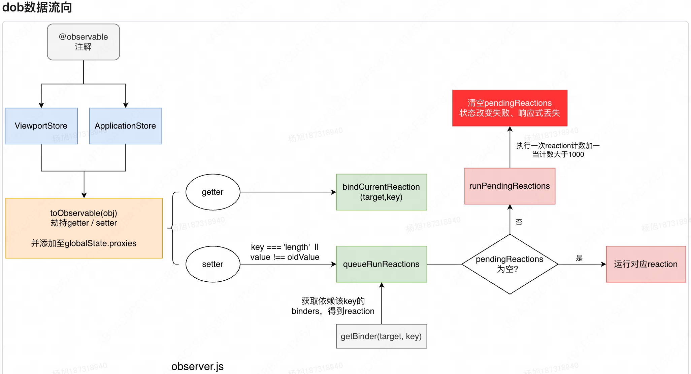 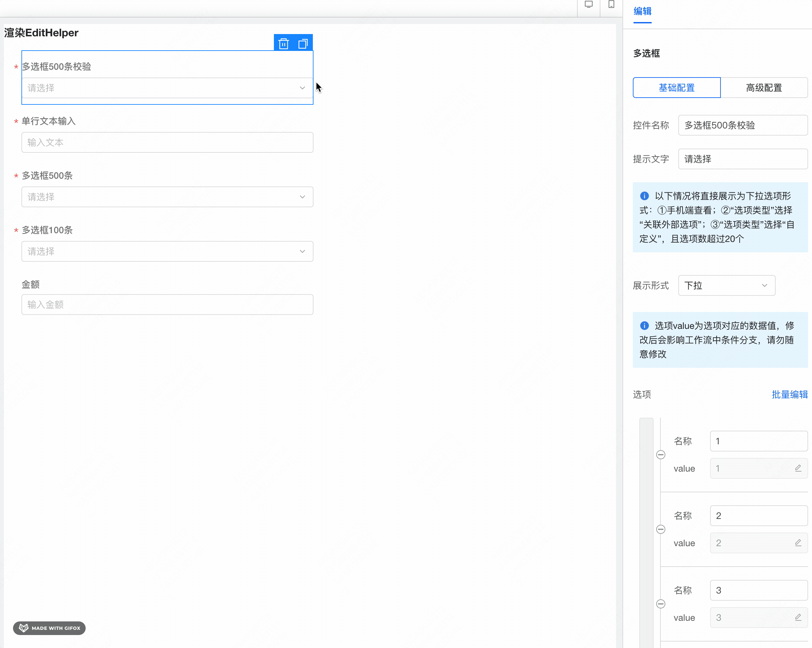
       - dob 响应式问题可能使设计器“瘫痪”，@吴学谦已经优化过几次校验设计，提高了响应式稳定性。但目前还不清楚新增组件如何影响 reaction 数量，能否得到一个可量化的值，来推断设计器组件上限，为后续开发兜底。结合引擎校验设计，debugger组件新增、选中等逻辑，发现reaction主要受显示条件、控件校验、显示方式3类校验属性影响，meta每包含一种校验属性，就会创建一个reaction
         - **页面的所有操作都会触发reaction执行**，dob会通过Proxy代理每个对象，在getter里将属性 绑定当前Reaction，这样触发setter需要更新的时候，执行所有绑定的reaction即可；所以随着选项的增加，需要Prox代理的对象及绑定的reaction就越多，pendingReactions长度越大，当复制500条选项单多选组件时，会触发大量的reaction更新，而代码中对reaction的执行计数有限制，超过该值时，响应式就会丢失，无法触发应有的更新；reaction的绑定和选项数量成正比 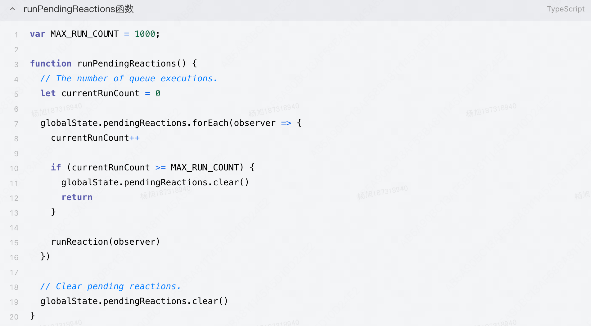
     - 分析并定义性能指标、基准值定义
       - 与学城、表格不同，快搭更注重单点交互性能，如新增节点、选中节点、属性编辑等操作，更看重单帧最大渲染时长、及平均FPS指标，卡顿帧数、内存占用作为辅助指标
       - 各指标的基准值定义如下：以v1.7版本各场景测试指标结果为基础，设立 50%波动范围，最大值作为卡控基准值。举例：添加组件的单帧最大渲染时长是200ms，波动范围是 200 \* 50% = 100ms，则基准值是 200 + 100 = 300ms
     - **指标稳定性保证：异常值处理**
       - 单帧最大渲染时间偶现尖刺异常数据处理
       - 首屏时间波动处理

   **结果**
   一期耗时 15pd 左右实现工具可用，拿到快搭核心场景性能现状，经过约 5个迭代沉淀，基本完成线下性能卡控工具落地
   卡控Case：🔴 v1.9性能测试报告-1发现表单解析时间指标获取失败，排查发现代码合并过程中指标获取方法被误删导致，线下卡控提前发现代码错误，避免影响线上监控指标
   线下验证：对日程卡片首次选中按钮组卡顿问题 验证测试卡控工具效果，测试发现：单帧最大渲染时长增加超过 80ms，平均 fps 降低超过 7，从结果可以看到明显性能恶化

**24年总结**：
上半年负责快搭及开放平台业务，下半年全面投入快搭；所有需求按时交付、保质保量，千行代码bug率：26 / 97421 = 0.266‰，相比去年更加关注交付结果
发声更多、能够更加主动的承担团队事务，如主动提出梳理每周性能运营指标，辅助团队分析和解决问题
刨根问底：遇到 nest 部署失败问题，跟进并寻求解决方案，后来一次 node 版本导致线下发布报错给出建议，辅助解决问题
但是像性能测试上有时思考不够，缺少后续相应动作

## 项目中遇到最大的困难是什么？

1.  动画场景使用 requestAnimationFrame（RAF）
    RAF原理：浏览器原⽣ API，专为浏览器设计。
    核⼼优势：与屏幕刷新率同步 60Hz/16.67ms，避免卡顿；RAF 在页面不可见时自动暂停，节省CPU，后台标签⻚⾃动暂停。可以将多次DOM操作合并到一帧内执行，在浏览器下一次重绘之前执行，避免布局抖动。解决了传统 `setTimeout/setInterval` 做动画时 “不同步、易卡顿、耗性能” 的问题

2.  为什么不用标准 EventSource，而是用fetch+post请求模拟 SSE ？
    - 核心原因：EventSource 只支持 GET，不能带 body
      - 发送一个消息需要携带 messages、会话 id 等字段，必须放在 body 里，因为消息内容可能很长（几千 token 的上下文），放 URL 里会超长，以及包含文件附件、结构化数据，URL 参数无法承载

3.  **Skill 开发、评测、大盘搭建、错误治理、skill调优**
    - skill eval 评测过程，测试集怎么来？指标有哪些？评测模型如何选？ 4.1测试，gemini-3.1评测。由于agent的不确定性，结果对过程不一定对，过程对结果不一定对！
    - 计算质量得分点数 (0~5)
      - 规范检查 >= 80%: +1 // 2. 功能评测 >= 70%: +1 // 3. 功能用例数 >= 10: +1 // 4. Trigger 评测 >= 70%: +1 // 5. Trigger 用例数 >= 10: +1
        pass@k：k 次采样中至少 1 次通过的概率（衡量模型潜力） // OPEN_AI
        pass^k：k 次采样全部通过的概率（衡量模型稳定性）
    - 规范检查指标说明：企业 Skill 标准规范 v1.0
      触发测试：触发率、应该触发、哪些不触发
      功能测试：
      - 正常路径 - 完整流程能跑通 - 输出结果正确，API 调用成功
      - 边界场景 - 空输入、超长输入等 - 有友好报错，不崩溃
      - 错误处理 - 故意触发已知错误 - 按 SKILL.md 指导给出解法
    - 性能测试：
      - 对比有/无 Skill 时同一任务的：多轮对话次数、Token 消耗量、API 调用失败率
    - 自动化用例执行指标说明：官方skills测试方案&准出规范
      ​npx --registry=xxx @it/oa-skills-eval@latest --skill hr-hiring
    - Skill 触发指标说明：xxx规范
    - skill调优：
      - ```
        skill碰撞问题：approval和initate-approval skill碰撞，严格指定路由优先级-路由方向，deacription增加不适用的说明话术
          ① 修改 approval skill 的 description：
            在不适用里明确加上 "发起/填写/提交单据 → 请使用 initiate-approval skill"
          ② 修改 initiate-approval skill 的 description：
            明确排他说明："凡用户意图是新建/提交一条单据，无论是否提供了流程名称，均走此 skill"
          ③ 在 initiate-approval 里加明确的路由声明（最根本的修法），在 SKILL.md 顶部添加：
            路由优先级：只要用户意图是「新建/发起/填写/提交」，无论表述如何，本 skill 优先于 approval skill
        ```

4.  skill 错误治理 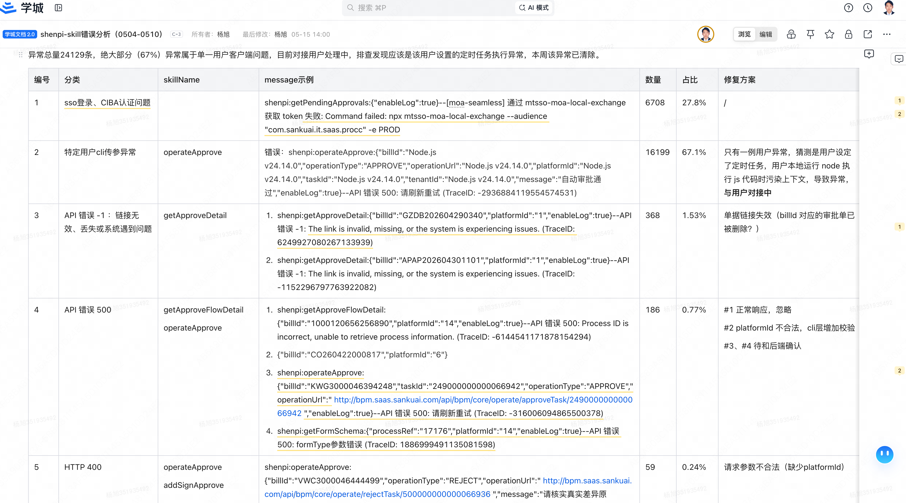 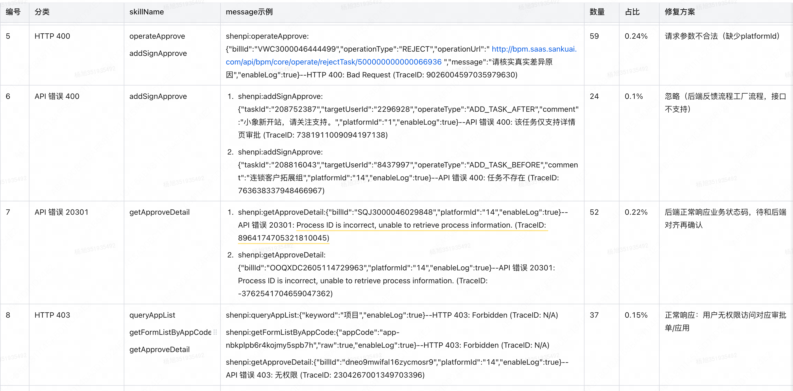

5.  ttagent前期开发，做了工单目录匹配RAG搜索，后面负责做了沙箱接入，提供给agent用来执行skill管理安装和调用，代码执行，以及分用户分租户搭建沙箱内agent工作区workspace，支持上传文件，执行skill等操作。后续被同事封装成Java版本，提供RPC接口供其他Java后端调用

6.  组件库mtd升级小版本导致样式丢失：原因是组件库业务有部分js导入的样式，他们打包时配置了 sideEffect: ['*/.css', '*/.less']，不包括 js ，导致样式没有打包进去，通过在webpack里配置该组件样式文件的sideEffect为true解决
    - 新增了Tree-shaking的配置，但是没有将/style/css.js文件包含进去，导致最后样式文件被剔除。
      ```ts
      // babel-plugin-import 转换后
      import DatePicker from '@ss/mtd-react3/lib/date-picker';
      import '@ss/mtd-react3/lib/date-picker/style/css'; // ← 导入 style/css.js
      // webpack 处理流程：
        1. 检查 sideEffects 配置
        2. 发现 style/css.js 不在列表中
        3. 认为这个文件没有副作用
        4. tree-shaking 删除了这个文件
        5. 结果：样式没有加载！❌
      ```
    - 临时解决方案：进行配置，强制标记为有副作用，不让其被剔除
      ```ts
      config.module
        .rule('mtd3-style')
        .test(/\/style\//)
        .include.add(/node_modules\/@ss\/mtd-react3/)
        .end()
        .sideEffects(true);
      ```

7.  wenjuan emoji表情索引问题修复
    - ```
      索引不一致问题：draft-js 内部使用 字符索引 (accounting for surrogate pairs)，draftjs-to-html 则使用 UTF-16代码单元索引
      而 emoji 占用2个代码单元但只算1个字符，所以 draftjs 输出的索引和 draftjs-to-html 期望的索引存在偏差，两种 ranges 都会产生偏移。
      修复方案：通过计算 emoji 位置和数量来增加 draftjs 输出样式的 offset 和 length，使索引与 UTF-16 索引对齐，适配 draftjsToHtml 的输入
      UTF-16 编码差异：Emoji字符(如👑)使用 surrogate pair 编码，在 UTF-16 中占用2个代码单元，但逻辑上是1个字符issue：https://github.com/jpuri/draftjs-to-html/issues/41
      ```

8.  鸿蒙用户点评问卷无法扫码登录问题排查及修复
    - 捞日志-查看设备类型 deviceType，当前accountType，根据目前排查考虑是鸿蒙系统6.0+版本点评的ua问题，现有问卷根据 /dp\//i.test(ua) 判断点评账号类型，没有match上鸿蒙系统的ua，导致被识别成美团用户（日志里看到保存的账号类型也是2，对应美团账号类型）
    - 鸿蒙ua：Mozilla/5.0 (Phone; OpenHarmony 6.0) AppleWebKit/537.36 (KHTML, like Gecko) Chrome/132.0.0.0 Safari/537.36 ArkWeb/6.0.0.130 Mobile MT_WEB_UA/0.0.1 KNB/0.17.1 DianpingNova/11.62.1 AppId/1/11.62.1 MSI/12.55.200
    - 修复后日志，用户accountType正确识别为9（原是2）：

## 项目重难点、亮点补充

1. iframe 场景下 Modal 弹窗关闭问题
   快搭应用前后台是两个项目，部署在统一域名下，访问后台时，内部实际上是通过微前端嵌入的应用前台，当用户在后台点击新增记录、查看记录详情时，是弹窗形式打开，这里有个骚操作：由于我们有自定义按钮、关联表单记录控件的存在，实际上可以继续点击某个详情页，然后又会打开一个单据页面，这样就出现了无限嵌套，但由于最外层是 iframe 打开的第一个页面，导致了无法关闭，所以就 hack 了每个弹窗的 关闭 按钮，当点击关闭时，通过 postMessage 设计一套打开/关闭 Modal 弹窗数据结构，实现父子页面通信来一层层关闭弹窗，实现很脏，但也没有其他好办法。
2. mtd-react2.0升级到mtd3.0
   涉及 40+ 组件⽂件适配，完成 moment 到 dayjs 的完整迁移
   微前端⼦应⽤中antd4 -> 5，除了升级（CSS in JS），还要兼容⽼的less⽂件和ppfish样式
   通过⾃定义 Less 插件绕过颜⾊函数对 CSS 变量的编译限制
   - 有遇到哪些主要的 break change？
     - 样式打包问题：遇到过一次样式丢失问题：新版本组件样式webpack打包设置只处理 .css styles/ 文件下的样式文件，但有一些样式是通过 js 引入的，导致我升级后样式丢失
     - API 重命名: `visible` -> `open`
     - 组件逻辑修改：导致嵌套的 popover 内的按钮添加 disabled 后不生效
     - 时间选择器不支持传入 `0ms` 场景：导致无法识别，时区日期控件踩坑
   - moment 迁移到 dayjs 需要注意什么？
     - 大部分 API 可以兼容，dayjs 是最小化设计，比如国际化需要单独引入插件
3. 设计一个支持运行时主题切换的组件库主题系统，你会怎么做？
   - 类似 antd 那种，设计一个全局的 ThemeProvider，支持用户传入配置和主题，通过 less 变量完成主题替换，注入到 :root根组件 或 容器
   - `Tailwindcss` 是零运行时吗？：是的，运行时零开销。它在构建时扫描源码中的类名，⽣成纯 CSS ⽂件。运⾏时浏览器只需要解析普通 CSS，不需要执行任何 js
4. SSE 相关（**复习文档76页**）
   - SSE 是⼀种服务器向客户端单向推送数据的技术，后端通过设置响应头 text/event-stream 格式持续发送数据块，前端逐步接收并渲染，形成打字机效果。

   ```
   后端设置：
   Content-Type: text/event-stream
   Cache-Control: no-cache
   Connection: keep-alive HTTP/1.1默认，让连接保持
   ```

   - 项⽬中如何使用？
     - 使⽤ fetch + ReadableStream ⽽⾮原⽣ EventSource（因为需要 POST 请求）；
     - 使⽤ eventsource-parser 库解析 SSE 格式；
     - ⽀持 [DONE] 标记结束流；
     - 配合 TypeWriter 实现打字机效果（⼀个实现打字机效果的⼯具类，⽤于在 AI 流式输出时，让⽂字逐字显示，模拟⼈类打字的视觉效果）
       - 原理：SSE 数据到达 → 加⼊队列 → 定时器逐字消费 → 界⾯逐字显示
       - 动态调整，队列⻓→快，队列短→慢；setTimeout 递归
       - 解耦⽹络速度与渲染速度，提供平滑体验
       - ⼀次性输出剩余内容，不拖沓
     - `ReadableStream`： Web Streams API 的核⼼接⼝，⽤于զၞ式̵分ࣘҁchunk҂ጱ⽅式᧛ݐ数ഝ，不必等
       全部数据加载完再处理，适合处理⼤⽂件、⽹络流式响应（如 SSE、视频流、AI 流式回答）。在浏览器中fetch() 返回的 response.body 就是⼀个 ReadableStream

   - SSE 如何处理断线重连？
     - 原⽣ EventSource 内置重连机制，连接中断时浏览器自动尝试重新连接，开发者无需手动处理
       - 支持历史事件 ID：可通过 last-event-id 请求头实现断点续传，避免数据丢失
     - fetch 实现需⼿动：利用 `Last-Event-ID` 请求头和消息中的`id`字段实现，断开时重新请求

   - 如何保证弱网环境下 SSE 的传输稳定性（**断网重连+断点续传**）？
     - 重连：循环到指定5次，间隔短到⻓（指数退避）
       - 最⼤重试次数 / 最⼤退避时间，计数器控制次数、setTimeout 控制间隔
       - 区分可重试错误（⽹络/5xx）和致命错误（401/403/4xx）
       - ⽹络恢复事件触发⽴即重连：window.addEventListener('online', () => sse.connect())
       - ⻚⾯ visibilitychange 时考虑暂停/恢复
     - **断点续传核心机制**： [文档](https://adg.csdn.net/695255255b9f5f31781b92f4.html)
       - 消息标识：服务端推送消息时在数据流中附加 `id/msgId` 字段，来唯一标识每条数据
       - 自动重连：连接意外中断时，浏览器会自动发起重连，并默认携带一个名为 `Last-Event-ID` 的 HTTP 请求头
       - 断点续传：服务端读取该请求头，即可知道客户端上一次成功接收的位置，从数据库或缓存中查询该 ID 之后的数据继续推送，字段不存在或为空则从头开始推送

         ```格式必须正确
         : 注释 # 可缺省
         id: 1001 # 消息ID
         event: 事件类型 # 可缺省
         data: 消息内容

         ```

       - 客户端必要保证：虽然浏览器会自动重连并发送 Last-Event-ID，但若遇到页面刷新或手动重连，原生的 `EventSource` 状态会丢失。为了实现绝对可靠的断点续传，前端建议做以下增强：监听更新：通过 `onmessage` 实时记录最新的 event.lastEventId 到 localStorage 或 SessionStorage 中。手动重建：在页面初始化时，读取本地存储的 ID，并将其拼接到 URL 中（如 /stream?lastEventId=xxx），服务端读取此参数即可作为起点
         > 客户端记住最后⼀次收到的 id（叫 lastEventId）
         > 重连时通过 Last-Event-ID 请求头告诉服务端
         > 服务端从这个 ID 之后的位置继续推送 → 实现断点续传

5. 搜索输入框竞态条件

   > ⽤户快速输⼊搜索词，先发的请求后返回，覆盖了正确的结果
   > ⽐如输⼊"app"发请求 A，再输⼊"apple"发请求 B，如果 B 先返回，A 后返回，界⾯会显示"app"的结果，⽽不是⽤户期望的"apple"结果
   - 使⽤防抖，减少请求次数
   - 使⽤࢏请求计数器，丢弃过期的请求结果
     > 每次请求前计数器 +1，记录当前值。请求返回时，⽐较当前值和计数器是否⼀致，不⼀致就丢弃
   - 进一步的可封装一个 `searchAjax` 请求：多次请求时取消前面的请求，防止请求竞态

6. react-activation 库，react 组件保活机制实现，createPortal，LRU 缓存
