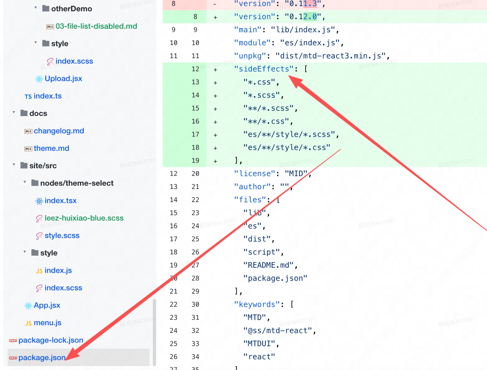

## 项目介绍

- 项目介绍、负责哪些模块、重难点及解决方案
- **Vercel AI SDK 6** 构建生产级 Agent [文章](https://cloud.tencent.com/developer/article/2685429)
  - 基于 AI SDK 的工作范式：
    - 顺序处理（Sequential Processing）：连续调用streamText
    - 路由（Routing）
      - 场景：根据用户咨询类型（退款、技术支持、一般问题），分配给不同处理逻辑或不同大小的模型
      - 实现：先generateObject意图识别输出分类classification，再根据分类提示词调用streamText输出结果
    - 并行处理 (Parallel Processing)
      - 场景：代码审查（Code Review）。同时从“安全性”、“性能”和“可维护性”三个维度进行审查，最后汇总
      - 实现：使用Promise.all()请求多个不同提示词的 streamText，再汇总
    - 编排者-执行者 (Orchestrator-Worker)
      - 场景：实现一个新功能。编排者决定需要修改哪些文件，执行者分别去写每个文件的代码
      - 实现：generateObject拆分规划任务，streamText实现
    - ReAct 模式，评估-优化循环 (Evaluator-Optimizer)
      - 循环控制 TooLoopAgent：[文档](https://juejin.cn/post/7605769126271549486?from=search-suggest)
        - stopWhen：终止条件，可传入函数，比如：token 消耗超限终止循环
        - prepareStep：在循环的每一步发起大模型请求前运行，可以实现高度智能的动态行为
          - 根据 step > 3，切换到强模型；或者调整可用工具及调用规则
          - 上下文剪裁：messages.length > 20，滑动窗口裁剪只保留最近 10 条记录

## 项目中遇到最大的困难是什么？

1.  动画场景使用 requestAnimationFrame（RAF）
    RAF原理：浏览器原⽣ API，专为ۖኮ设计。
    核⼼优势：与屏幕刷新率同步 60Hz/16.67ms，避免卡顿；RAF 在页面不可见时自动暂停，节省CPU，后台标签⻚⾃动暂停。可以将多次DOM操作合并到一帧内执行，在浏览器下一次重绘之前执行，避免布局抖动。解决了传统 `setTimeout/setInterval` 做动画时 “不同步、易卡顿、耗性能” 的问题

2.  为什么不用标准 EventSource，而是用fetch+post请求模拟 SSE ？
    - 核心原因：EventSource 只支持 GET，不能带 body
      - 发送一个消息需要携带 messages、会话 id 等字段，必须放在 body 里，因为消息内容可能很长（几千 token 的上下文），放 URL 里会超长，以及包含文件附件、结构化数据，URL 参数无法承载

3.  Skill 开发、评测、大盘搭建、错误治理、skill调优
    - skill eval 评测过程，测试集怎么来？指标有哪些？评测模型如何选？ 4.1测试，gemini-3.1评测。由于agent的不确定性，结果对过程不一定对，过程对结果不一定对！
    - 计算质量得分点数 (0~5)
      - 规范检查 >= 80%: +1 // 2. 功能评测 >= 70%: +1 // 3. 功能用例数 >= 10: +1 // 4. Trigger 评测 >= 70%: +1 // 5. Trigger 用例数 >= 10: +1
        pass@k：k 次采样中至少 1 次通过的概率（衡量模型潜力） // OPEN_AI
        pass^k：k 次采样全部通过的概率（衡量模型稳定性）
    - 规范检查指标说明：企业 Skill 标准规范 v1.0
      触发测试：触发率、应该触发、哪些不触发
      功能测试：
      - 正常路径 - 完整流程能跑通 - 输出结果正确，API 调用成功
      - 边界场景 - 空输入、超长输入等 - 有友好报错，不崩溃
      - 错误处理 - 故意触发已知错误 - 按 SKILL.md 指导给出解法
    - 性能测试：
      - 对比有/无 Skill 时同一任务的：多轮对话次数、Token 消耗量、API 调用失败率
    - 自动化用例执行指标说明：官方skills测试方案&准出规范
      ​npx --registry=xxx @it/oa-skills-eval@latest --skill hr-hiring
    - Skill 触发指标说明：xxx规范
    - skill调优：
      - ```
        skill碰撞问题：approval和initate-approval skill碰撞，严格指定路由优先级-路由方向，deacription增加不适用的说明话术
          ① 修改 approval skill 的 description：
            在不适用里明确加上 "发起/填写/提交单据 → 请使用 initiate-approval skill"
          ② 修改 initiate-approval skill 的 description：
            明确排他说明："凡用户意图是新建/提交一条单据，无论是否提供了流程名称，均走此 skill"
          ③ 在 initiate-approval 里加明确的路由声明（最根本的修法），在 SKILL.md 顶部添加：
            路由优先级：只要用户意图是「新建/发起/填写/提交」，无论表述如何，本 skill 优先于 approval skill
        ```

4.  ttagent前期开发，做了工单目录匹配RAG搜索，后面负责做了沙箱接入，提供给agent用来执行skill管理安装和调用，代码执行，以及分用户分租户搭建沙箱内agent工作区workspace，支持上传文件，执行skill等操作。后续被同事封装成Java版本，提供RPC接口供其他Java后端调用

5.  组件库mtd升级小版本导致样式丢失：原因是组件库业务有部分js导入的样式，他们打包时配置了 sideEffect: ['*/.css', '*/.less']，不包括 js ，导致样式没有打包进去，通过在webpack里配置该组件样式文件的sideEffect为true解决
    - 新增了Tree-shaking的配置，但是没有将/style/css.js文件包含进去，导致最后样式文件被剔除。
      ```ts
      // babel-plugin-import 转换后
      import DatePicker from '@ss/mtd-react3/lib/date-picker';
      import '@ss/mtd-react3/lib/date-picker/style/css'; // ← 导入 style/css.js
      // webpack 处理流程：
        1. 检查 sideEffects 配置
        2. 发现 style/css.js 不在列表中
        3. 认为这个文件没有副作用
        4. tree-shaking 删除了这个文件
        5. 结果：样式没有加载！❌
      ```
    - 临时解决方案：进行配置，强制标记为有副作用，不让其被剔除
      ```ts
      config.module
        .rule('mtd3-style')
        .test(/\/style\//)
        .include.add(/node_modules\/@ss\/mtd-react3/)
        .end()
        .sideEffects(true);
      ```

6.  wenjuan emoji表情索引问题修复
    - ```
      索引不一致问题：draft-js 内部使用 字符索引 (accounting for surrogate pairs)，draftjs-to-html 则使用 UTF-16代码单元索引
      而 emoji 占用2个代码单元但只算1个字符，所以 draftjs 输出的索引和 draftjs-to-html 期望的索引存在偏差，两种 ranges 都会产生偏移。
      修复方案：通过计算 emoji 位置和数量来增加 draftjs 输出样式的 offset 和 length，使索引与 UTF-16 索引对齐，适配 draftjsToHtml 的输入
      UTF-16 编码差异：Emoji字符(如👑)使用 surrogate pair 编码，在 UTF-16 中占用2个代码单元，但逻辑上是1个字符issue：https://github.com/jpuri/draftjs-to-html/issues/41
      ```

7.  鸿蒙用户点评问卷无法扫码登录问题排查及修复
    - 捞日志-查看设备类型 deviceType，当前accountType，根据目前排查考虑是鸿蒙系统6.0+版本点评的ua问题，现有问卷根据 /dp\//i.test(ua) 判断点评账号类型，没有match上鸿蒙系统的ua，导致被识别成美团用户（日志里看到保存的账号类型也是2，对应美团账号类型）
    - 鸿蒙ua：Mozilla/5.0 (Phone; OpenHarmony 6.0) AppleWebKit/537.36 (KHTML, like Gecko) Chrome/132.0.0.0 Safari/537.36 ArkWeb/6.0.0.130 Mobile MT_WEB_UA/0.0.1 KNB/0.17.1 DianpingNova/11.62.1 AppId/1/11.62.1 MSI/12.55.200
    - 修复后日志，用户accountType正确识别为9（原是2）：

## 项目重难点、亮点补充

1. iframe 场景下 Modal 弹窗关闭问题
   快搭应用前后台是两个项目，部署在统一域名下，访问后台时，内部实际上是通过微前端嵌入的应用前台，当用户在后台点击新增记录、查看记录详情时，是弹窗形式打开，这里有个骚操作：由于我们有自定义按钮、关联表单记录控件的存在，实际上可以继续点击某个详情页，然后又会打开一个单据页面，这样就出现了无限嵌套，但由于最外层是 iframe 打开的第一个页面，导致了无法关闭，所以就 hack 了每个弹窗的 关闭 按钮，当点击关闭时，通过 postMessage 设计一套打开/关闭 Modal 弹窗数据结构，实现父子页面通信来一层层关闭弹窗，实现很脏，但也没有其他好办法。
2. mtd-react2.0升级到mtd3.0
   涉及 40+ 组件⽂件适配，完成 moment 到 dayjs 的完整迁移
   微前端⼦应⽤中antd4 -> 5，除了升级（CSS in JS），还要兼容⽼的less⽂件和ppfish样式
   通过⾃定义 Less 插件绕过颜⾊函数对 CSS 变量的编译限制
   - 有遇到哪些主要的 break change？
     - 样式打包问题：遇到过一次样式丢失问题：新版本组件样式webpack打包设置只处理 .css styles/ 文件下的样式文件，但有一些样式是通过 js 引入的，导致我升级后样式丢失
     - API 重命名: `visible` -> `open`
     - 组件逻辑修改：导致嵌套的 popover 内的按钮添加 disabled 后不生效
     - 时间选择器不支持传入 `0ms` 场景：导致无法识别，时区日期控件踩坑
   - moment 迁移到 dayjs 需要注意什么？
     - 大部分 API 可以兼容，dayjs 是最小化设计，比如国际化需要单独引入插件
3. 设计一个支持运行时主题切换的组件库主题系统，你会怎么做？
   - 类似 antd 那种，设计一个全局的 ThemeProvider，支持用户传入配置和主题，通过 less 变量完成主题替换，注入到 :root根组件 或 容器
   - `Tailwindcss` 是零运行时吗？：是的，运行时零开销。它在构建时扫描源码中的类名，⽣成纯 CSS ⽂件。运⾏时浏览器只需要解析普通 CSS，不需要执行任何 js
4. SSE 相关（**复习文档76页**）
   - SSE 是⼀种服务器向客户端单向推送数据的技术，后端通过设置响应头 text/event-stream 格式持续发送数据块，前端逐步接收并渲染，形成打字机效果。

   ```
   后端设置：
   Content-Type: text/event-stream
   Cache-Control: no-cache
   Connection: keep-alive HTTP/1.1默认，让连接保持
   ```

   - 项⽬中如何使用？
     - 使⽤ fetch + ReadableStream ⽽⾮原⽣ EventSource（因为需要 POST 请求）；
     - 使⽤ eventsource-parser 库解析 SSE 格式；
     - ⽀持 [DONE] 标记结束流；
     - 配合 TypeWriter 实现打字机效果（⼀个实现打字机效果的⼯具类，⽤于在 AI 流式输出时，让⽂字逐字显示，模拟⼈类打字的视觉效果）
       - 原理：SSE 数据到达 → 加⼊队列 → 定时器逐字消费 → 界⾯逐字显示
       - 动态调整，队列⻓→快，队列短→慢；setTimeout 递归
       - 解耦⽹络速度与渲染速度，提供平滑体验
       - ⼀次性输出剩余内容，不拖沓
     - `ReadableStream`： Web Streams API 的核⼼接⼝，⽤于զၞ式̵分ࣘҁchunk҂ጱ⽅式᧛ݐ数ഝ，不必等
       全部数据加载完再处理，适合处理⼤⽂件、⽹络流式响应（如 SSE、视频流、AI 流式回答）。在浏览器中fetch() 返回的 response.body 就是⼀个 ReadableStream

   - SSE 如何处理断线重连？
     - 原⽣ EventSource 内置重连机制，连接中断时浏览器自动尝试重新连接，开发者无需手动处理
       - 支持历史事件 ID：可通过 last-event-id 请求头实现断点续传，避免数据丢失
     - fetch 实现需⼿动：利用 `Last-Event-ID` 请求头和消息中的`id`字段实现，断开时重新请求

   - 如何保证弱网环境下 SSE 的传输稳定性（**断网重连+断点续传**）？
     - 重连：循环到指定5次，间隔短到⻓（指数退避）
       - 最⼤重试次数 / 最⼤退避时间，计数器控制次数、setTimeout 控制间隔
       - 区分可重试错误（⽹络/5xx）和致命错误（401/403/4xx）
       - ⽹络恢复事件触发⽴即重连：window.addEventListener('online', () => sse.connect())
       - ⻚⾯ visibilitychange 时考虑暂停/恢复
     - **断点续传核心机制**： [文档](https://adg.csdn.net/695255255b9f5f31781b92f4.html)
       - 消息标识：服务端推送消息时在数据流中附加 `id/msgId` 字段，来唯一标识每条数据
       - 自动重连：连接意外中断时，浏览器会自动发起重连，并默认携带一个名为 `Last-Event-ID` 的 HTTP 请求头
       - 断点续传：服务端读取该请求头，即可知道客户端上一次成功接收的位置，从数据库或缓存中查询该 ID 之后的数据继续推送，字段不存在或为空则从头开始推送

         ```格式必须正确
         : 注释 # 可缺省
         id: 1001 # 消息ID
         event: 事件类型 # 可缺省
         data: 消息内容

         ```

       - 客户端必要保证：虽然浏览器会自动重连并发送 Last-Event-ID，但若遇到页面刷新或手动重连，原生的 `EventSource` 状态会丢失。为了实现绝对可靠的断点续传，前端建议做以下增强：监听更新：通过 `onmessage` 实时记录最新的 event.lastEventId 到 localStorage 或 SessionStorage 中。手动重建：在页面初始化时，读取本地存储的 ID，并将其拼接到 URL 中（如 /stream?lastEventId=xxx），服务端读取此参数即可作为起点
         > 客户端记住最后⼀次收到的 id（叫 lastEventId）
         > 重连时通过 Last-Event-ID 请求头告诉服务端
         > 服务端从这个 ID 之后的位置继续推送 → 实现断点续传

5. 搜索输入框竞态条件

   > ⽤户快速输⼊搜索词，先发的请求后返回，覆盖了正确的结果
   > ⽐如输⼊"app"发请求 A，再输⼊"apple"发请求 B，如果 B 先返回，A 后返回，界⾯会显示"app"的结果，⽽不是⽤户期望的"apple"结果
   - 使⽤防抖，减少请求次数
   - 使⽤࢏请求计数器，丢弃过期的请求结果
     > 每次请求前计数器 +1，记录当前值。请求返回时，⽐较当前值和计数器是否⼀致，不⼀致就丢弃
   - 进一步的可封装一个 `searchAjax` 请求：多次请求时取消前面的请求，防止请求竞态

6. react-activation 库，react 组件保活机制实现，createPortal，LRU 缓存
